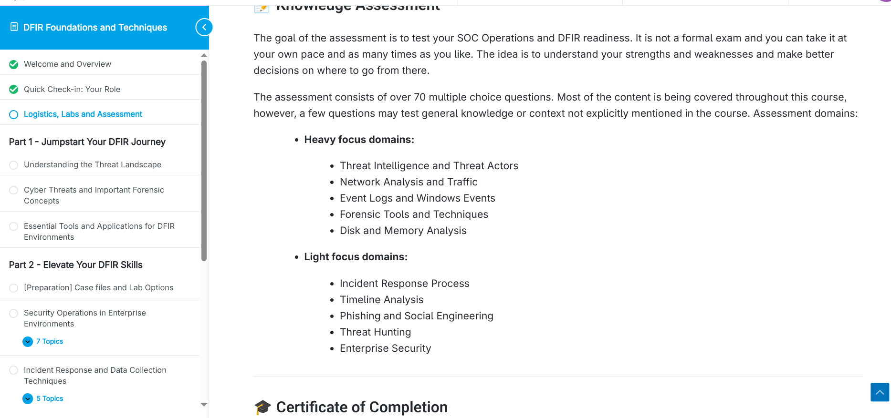
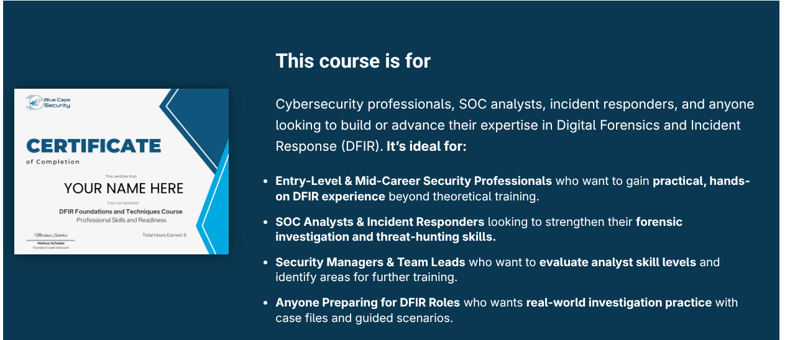
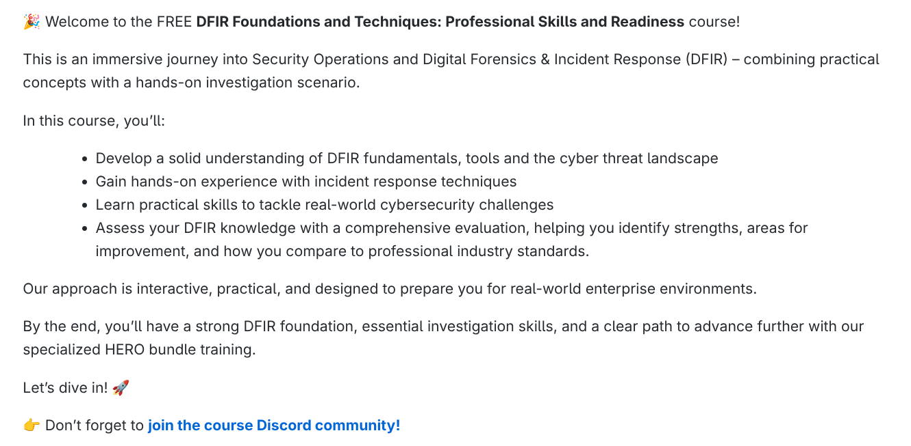
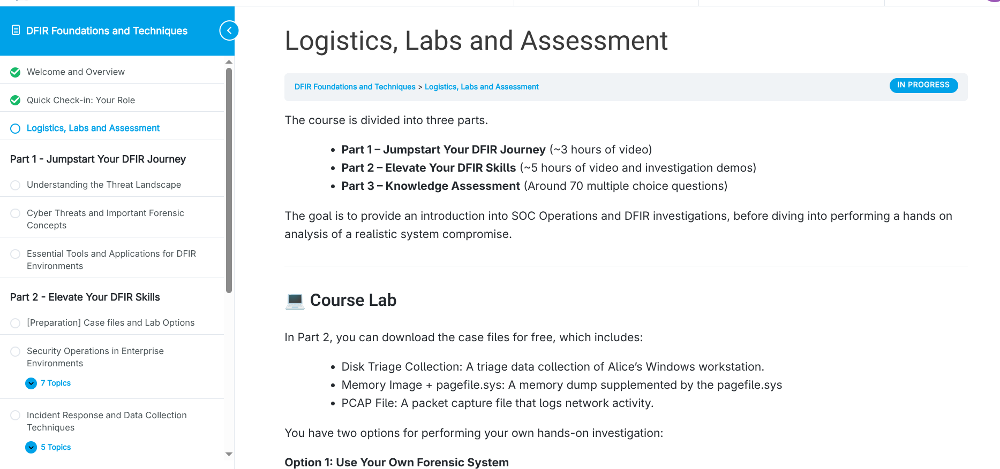
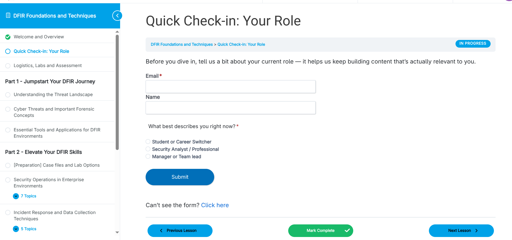
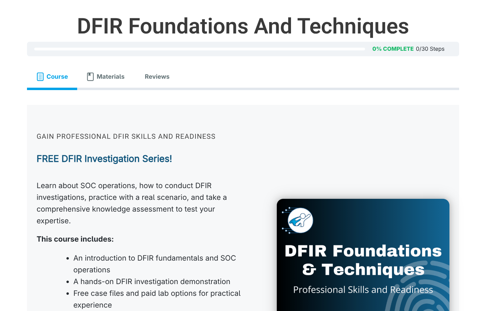

# Part 0 - Welcome

> **Cours :** [DFIR Foundations and Techniques: Professional Skills and Readiness](https://bluecapesecurity.com/courses/dfir-foundations-techniques-readiness/)
> **Plateforme :** Blue Cape Security
> **Format :** ~8h de vidéo, gratuit
> **Certif finale :** Certificate of Completion (8h créditées)

## Contexte

Avant de rentrer dans le vif du sujet (Part 1 et Part 2), le cours pose le cadre : à qui il s'adresse, comment il est structuré, et ce qu'on peut en attendre concrètement.

Le cours est gratuit et se positionne comme une porte d'entrée vers l'écosystème payant de Blue Cape (le "HERO bundle"). Il cible large : étudiants en reconversion, analystes SOC en poste, et même des team leads qui veulent évaluer le niveau de leur équipe.

## Objectifs annoncés

Le mot d'accueil du cours résume l'ambition en 4 points :

- Construire une base solide sur les fondamentaux DFIR, les outils, et le paysage des menaces
- Acquérir de l'expérience pratique sur les techniques de réponse à incident
- Développer des compétences applicables à des cas réels
- Évaluer son niveau via une assessment finale de ~70 questions

## Structure du cours

Le cours se découpe en 3 parties :

| Partie | Contenu | Durée |
|---|---|---|
| **Part 1** – Jumpstart Your DFIR Journey | Threat landscape, concepts forensiques, outils essentiels | ~3h |
| **Part 2** – Elevate Your DFIR Skills | Security Ops, Incident Response, **lab d'investigation complet** | ~5h + démos |
| **Part 3** – Knowledge Assessment | ~70 questions à choix multiples | à son rythme |

Point clé pour la suite : le lab de la Part 2 repose sur un scénario de compromission réaliste — poste de travail Windows d'un utilisateur nommé **Alice**, avec triage disque, dump mémoire (+ pagefile.sys), et capture réseau (PCAP). Deux options sont proposées : monter son propre système forensique (ce que je ferai) ou payer un accès VM tout prêt (30 jours, $29).

## Avant de commencer

Une étape de "check-in" demande de préciser son rôle actuel (étudiant/reconversion, analyste, manager) — probablement pour adapter les contenus futurs du cours ou de la plateforme.

## Assessment finale — domaines couverts

Pour anticiper ce qui compte vraiment dans ce cours, voici la répartition annoncée des ~70 questions de la Part 3 :

**Domaines à fort enjeu :**
- Threat Intelligence et acteurs de la menace
- Analyse réseau et trafic
- Event Logs et journaux Windows
- Outils et techniques forensiques
- Analyse disque et mémoire

**Domaines à enjeu plus léger :**
- Processus de réponse à incident
- Analyse de timeline
- Phishing et ingénierie sociale
- Threat Hunting
- Sécurité d'entreprise

Ça donne une bonne boussole pour prioriser mes notes dans les Parts 1 et 2 : je vais accorder plus de profondeur aux domaines "heavy focus" (logs Windows, analyse mémoire/disque, threat intel) plutôt qu'aux domaines plus légers.

## Prochaine étape

➡️ [Part 1 - Jumpstart Your DFIR Journey](../Part-1-Jumpstart/)
