# Lab: PCAP Analysis

> **Module:** Security Operations in Enterprise Environments
> **Tooling used:** Wireshark, CyberChef, Geany, Mousepad
> **Evidence file:** `traffic.pcapng`

## Scenario

This lab analyzes a network capture (`traffic.pcapng`) taken from Alice's workstation during a suspected compromise. The goal is to reconstruct the full infection chain — from initial DNS resolution to command-and-control (C2) activity — using packet-level evidence only.

## Investigation

### 1. Establishing scope: who is talking to whom

Starting broad with Wireshark's **Conversations** view (IPv4 tab) to get a sense of overall traffic volume and spot anything unusual against the noise of normal browsing activity.

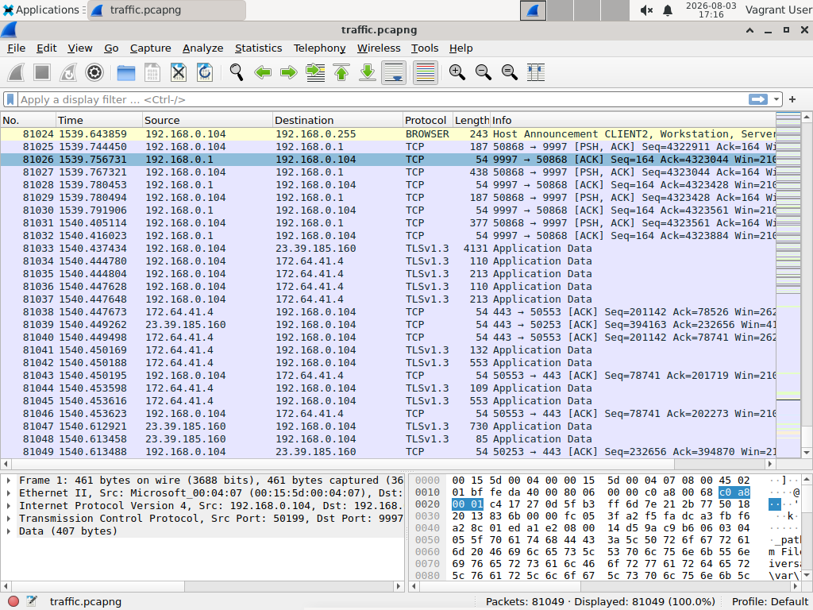

One destination stands out immediately: **`3.140.33.120`**, responsible for over 30,000 packets and 20 MB of traffic — far more than any other single endpoint on the capture, and unusual for what should be a routine workstation.

### 2. Confirming the lure: DNS typosquatting

Filtering DNS traffic for anything referencing the suspicious host reveals repeated queries for `w1ndowsupdate.com` — a **typosquatted domain** impersonating `windowsupdate.com`, with the lowercase "i" swapped for the digit "1". This is a classic social-engineering trick designed to look legitimate at a glance.

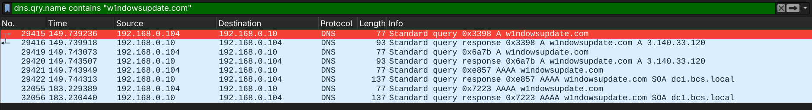

The DNS response resolves `w1ndowsupdate.com` to **`3.140.33.120`** — directly tying the lure domain to the high-traffic endpoint spotted in step 1.

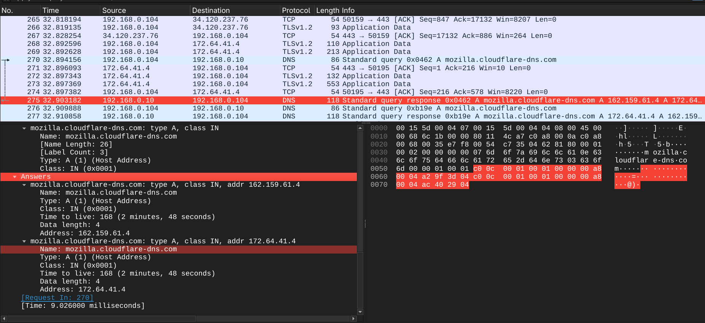
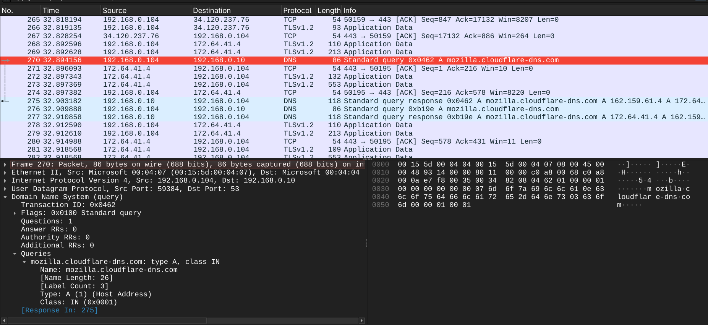

### 3. Initial access: browsing the fake update server

Filtering for HTTP and DNS traffic tied to the malicious domain and IP reconstructs the sequence of events cleanly:

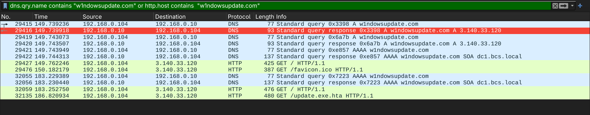

Alice's browser issues a `GET / HTTP/1.1` to `w1ndowsupdate.com:8000`. The server — identified via its response header as `SimpleHTTP/0.6 Python/3.11.9`, a lightweight Python HTTP server rather than any legitimate Microsoft infrastructure — replies with a **directory listing** exposing two files: `update.exe` and `update.exe.hta`.

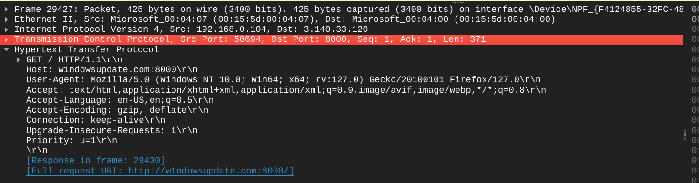

### 4. Delivery: the HTA dropper

A follow-up request, `GET /update.exe.hta`, retrieves the actual payload (`application/hta`, 2898 bytes).

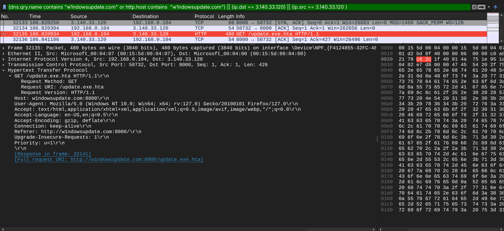
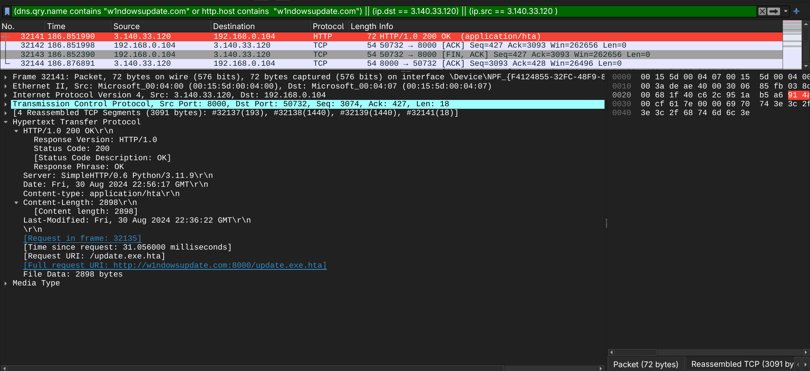

Extracting the file object directly from Wireshark (**File > Export Objects > HTTP**) confirms the full transaction and lets us pull the payload out for static analysis.

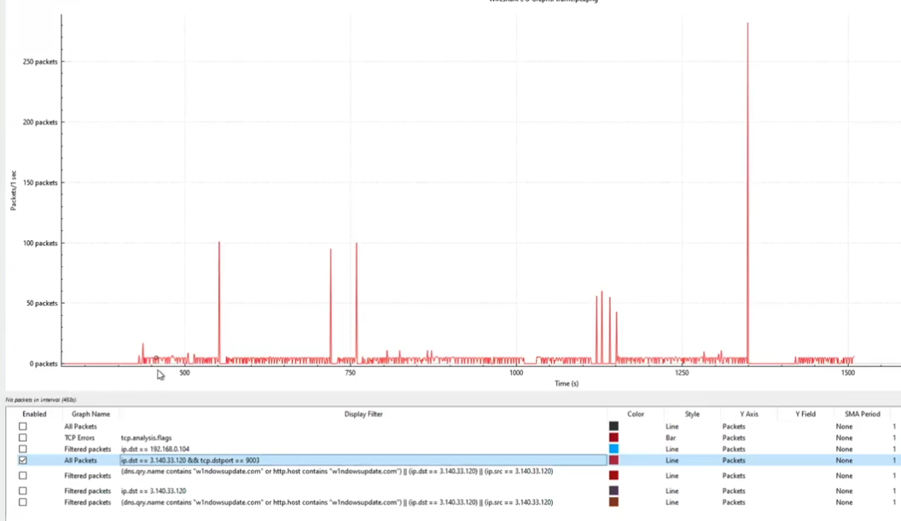

Opening `update.exe.hta` reveals a minimal HTA/JScript wrapper: a Base64-encoded blob assigned to a variable, passed straight to `powershell -noP -sta -w 1 -enc`, and launched via `ActiveXObject('WScript.Shell').Run()`. The `-w 1` flag hides the PowerShell window, and `-enc` tells PowerShell to treat the argument as a Base64-encoded (UTF-16LE) command.

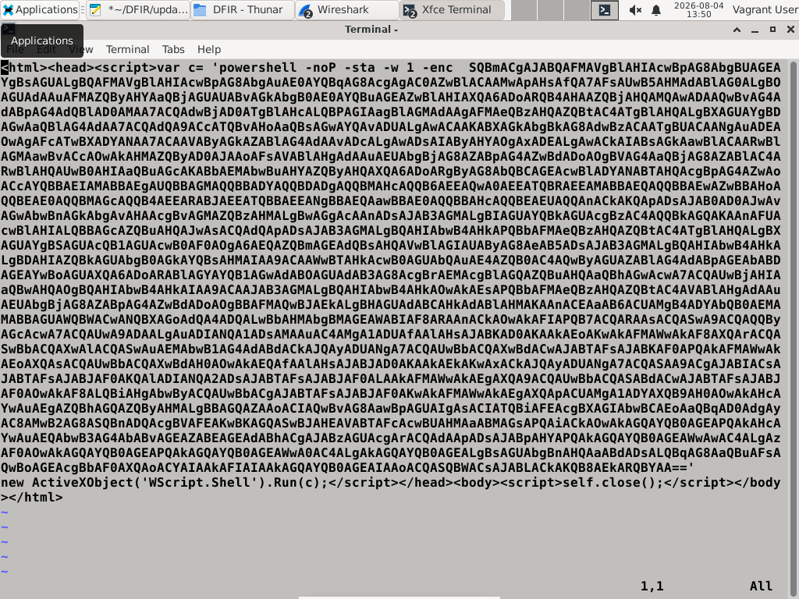
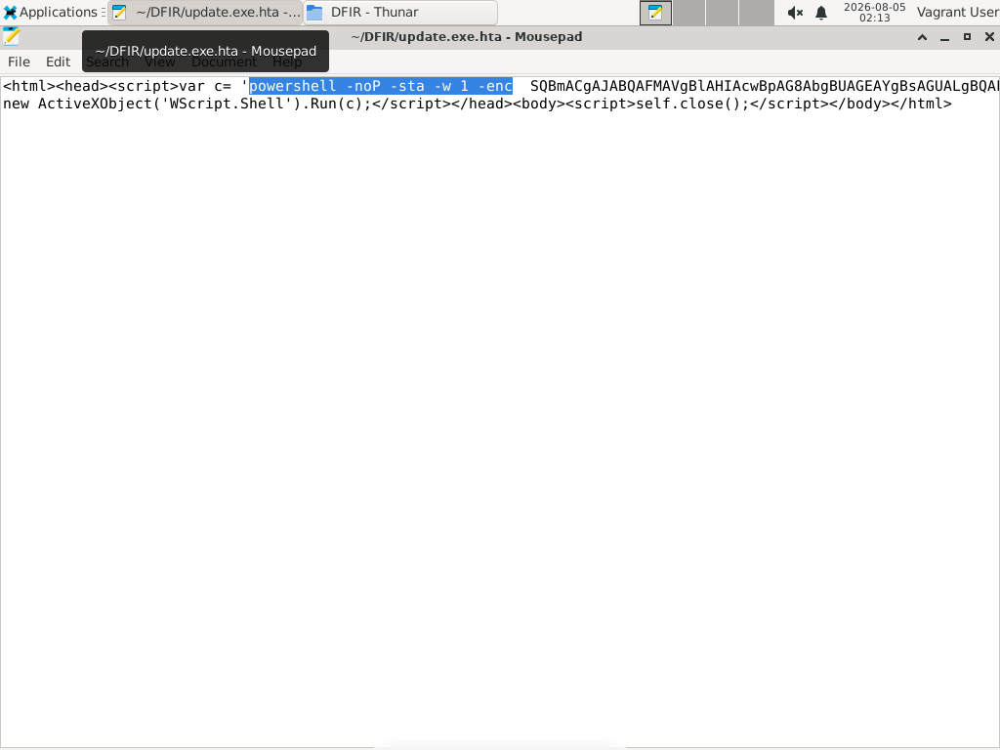

### 5. Decoding stage 1: from HTA to PowerShell

Feeding the Base64 blob into CyberChef (`From Base64` → `Remove null bytes`, since `-enc` payloads are UTF-16LE) reveals the actual PowerShell script.

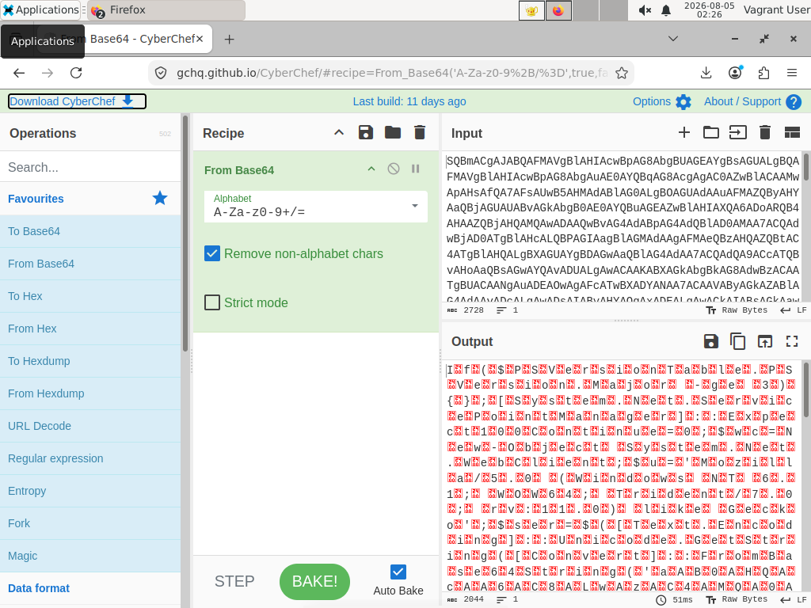
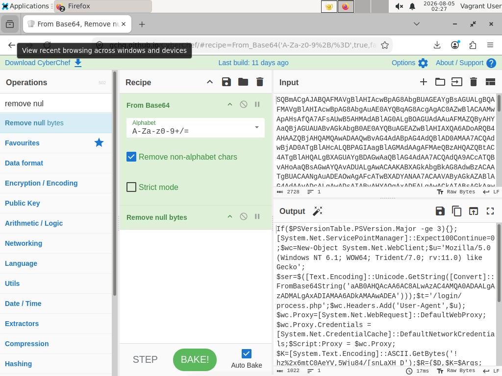

The decoded script (`payload.ps1`) does the following:

- Builds a `System.Net.WebClient` with a spoofed `User-Agent` (Internet Explorer 11 on Windows 7 — likely chosen to blend into older/legacy traffic patterns)
- Decodes a second Base64 string to obtain the C2 address: `http://3.140.33.120:9001`
- Defines an inline **RC4 implementation** (KSA + PRGA, visible as the classic `$S`/swap/`$J` key-scheduling loop) used to decrypt whatever is downloaded next
- Sets a hardcoded session cookie (`MbQrWboBJij=...`) — likely used by the C2 server to track or authenticate the beacon
- Downloads data from `3.140.33.120:9001/login/process.php`, strips a 4-byte IV prefix, RC4-decrypts the remainder, and pipes the result directly into `IEX` (Invoke-Expression)

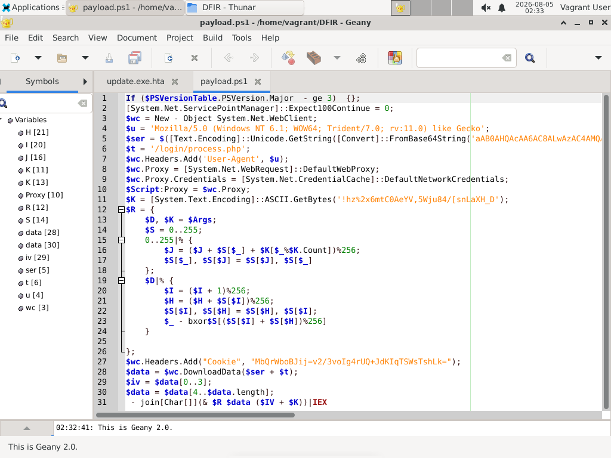

This is a textbook **multi-stage loader**: stage 1 (the HTA) only exists to fetch and decrypt stage 2 in memory, so nothing beyond the loader itself ever touches disk in cleartext — a deliberate evasion choice that limits what static, disk-based detection can catch.

### 6. Confirming ongoing C2 activity

Returning to Wireshark and pivoting on port 9001 traffic to `3.140.33.120` shows sustained, repeated communication well beyond the initial payload fetch — periodic requests to `get.php`, `process.php`, and `news.php`, each returning a consistent ~1,291-byte `text/html` response.

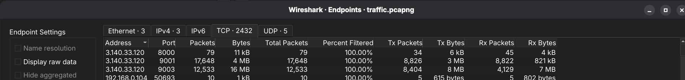
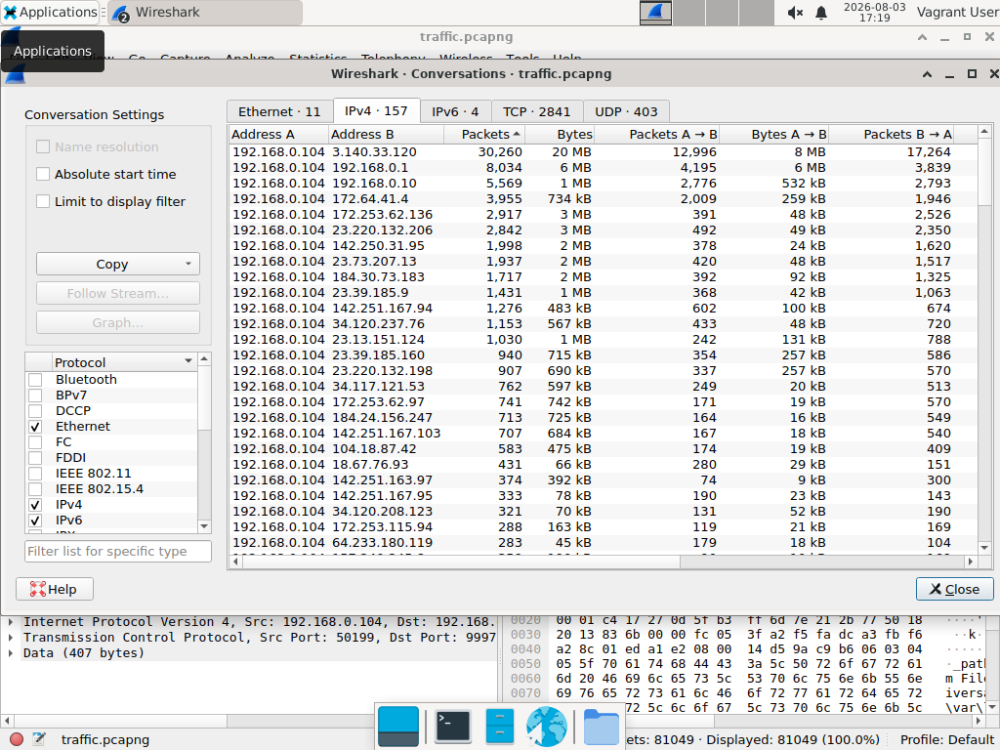
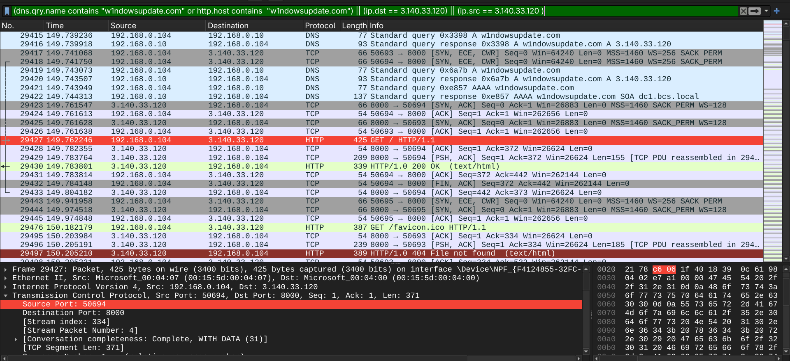
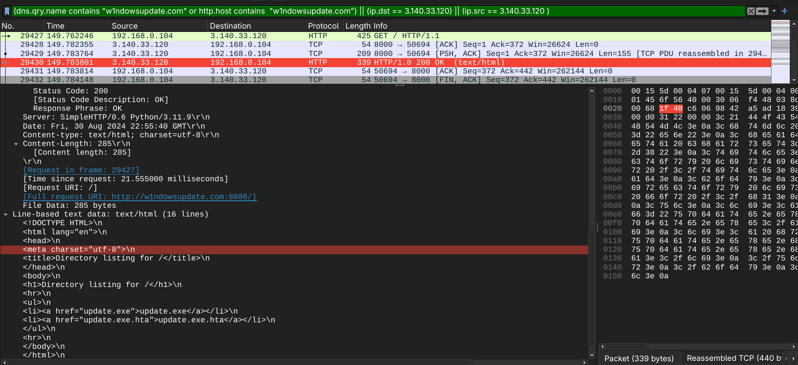
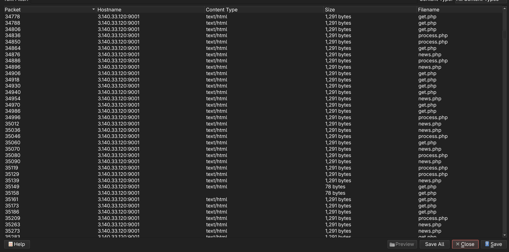

This traffic pattern — regular polling across multiple lightweight PHP endpoints, unencrypted HTTP, consistent response sizes — is consistent with **C2 beaconing**. The communication is confirmed and evidenced here; a deeper protocol-level breakdown of each endpoint's role was left out of scope for this specific PCAP-focused lab, to be revisited once host-based artifacts (memory, disk, logs) are brought in.

### 7. A note on transport security

Worth flagging separately: the entire chain — DNS lure, HTA delivery, PowerShell payload, and C2 traffic — happens over **plain, unencrypted HTTP**. Nothing here relies on TLS or certificate abuse; the attacker didn't need to, since the traffic was never inspected in the first place.

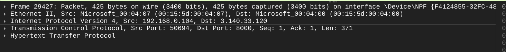

## Attack chain summary

| Stage | Action | Artifact |
|---|---|---|
| Lure | DNS query for typosquatted `w1ndowsupdate.com` | DNS response → `3.140.33.120` |
| Initial access | `GET /` reveals directory listing | HTTP 200, `SimpleHTTP/0.6 Python/3.11.9` |
| Delivery | `GET /update.exe.hta` | HTA dropper, 2898 bytes |
| Execution (stage 1) | HTA runs `powershell -enc <base64>` | Decoded PowerShell downloader |
| C2 setup | Script decodes C2 address + RC4 key | `3.140.33.120:9001`, hardcoded RC4 key |
| Stage 2 fetch | `GET /login/process.php` with cookie | RC4-encrypted response, IV-prefixed |
| Execution (stage 2) | RC4-decrypted payload piped to `IEX` | In-memory execution, no disk artifact |
| Persistence / C2 | Repeated polling on port 9001 | `get.php`, `process.php`, `news.php` |

## Detection & Mitigation

Framing this from a blue team perspective — what would have caught this, and what should have stopped it:

**Detection opportunities:**
- **DNS monitoring for typosquatted domains**: `w1ndowsupdate.com` is a single-character deviation from a legitimate Microsoft domain. A DNS security layer (e.g., protective DNS, Umbrella, or a simple Levenshtein-distance watchlist against known-good domains) would have flagged or blocked this resolution before any connection was made.
- **HTA execution from browser downloads**: Windows Defender Application Control (WDAC) or AppLocker policies restricting `.hta` execution — or at minimum alerting on `mshta.exe`/HTA-triggered PowerShell — is a well-known, high-value detection rule (this exact pattern maps to MITRE ATT&CK **T1218.005 – Mshta**).
- **PowerShell `-enc` flag usage**: encoded PowerShell commands are disproportionately used by malware versus legitimate admin activity. PowerShell Script Block Logging (Event ID 4104) combined with a SIEM rule flagging `-enc`/`-EncodedCommand` usage is a cheap, high-signal detection.
- **Unusual outbound HTTP beaconing**: regular, low-volume polling to the same external IP across multiple similarly-named endpoints (`get.php`, `process.php`, `news.php`) is a classic C2 fingerprint. Network detection tools (Zeek, Suricata) with beacon-detection logic, or even basic outbound traffic baselining, would surface this.
- **Plaintext HTTP to an unusual external IP on non-standard ports** (8000, 9001): egress filtering or a network IDS signature for suspicious port usage combined with executable/script content-types in the response would flag both the initial delivery and the C2 checkpoints.

**Mitigation / hardening:**
- Enforce DNS filtering at the network edge to block resolution of newly-registered or typosquatted domains.
- Restrict script host execution (`mshta.exe`, `wscript.exe`, `cscript.exe`) via application control policies, especially for files originating from browser downloads (mark-of-the-web enforcement).
- Enable and centrally collect PowerShell Script Block Logging and Module Logging — this alone would have captured the decoded payload in cleartext in the event logs, even with RC4 obfuscation over the wire.
- Egress-filter outbound traffic to only expected destinations/ports; alert on any workstation initiating connections to raw IPs on non-standard ports.

## Files in this folder

- `evidences/` — all packet capture screenshots referenced above
- `evidences/update.exe.hta` — the extracted HTA dropper (stage 0)
- `evidences/alice-payload.ps1` — the decoded PowerShell downloader (stage 1)
