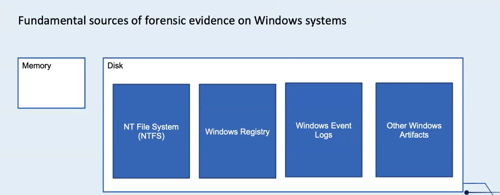
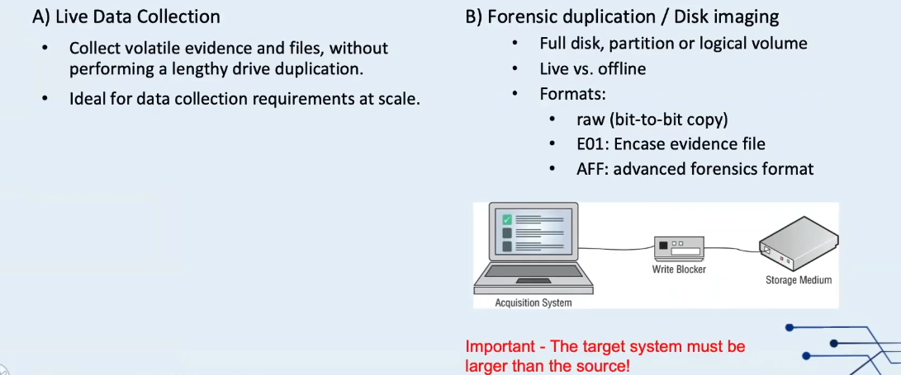
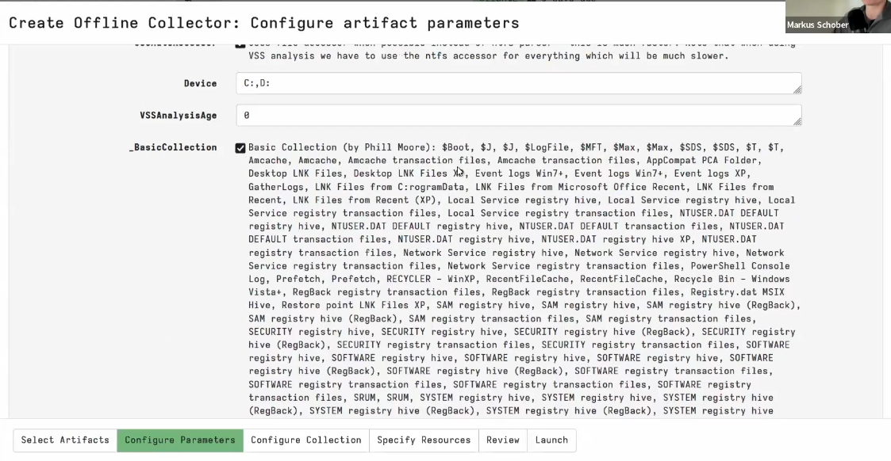
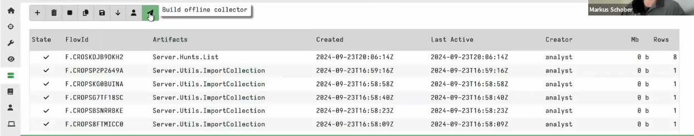
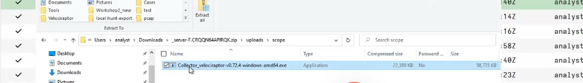
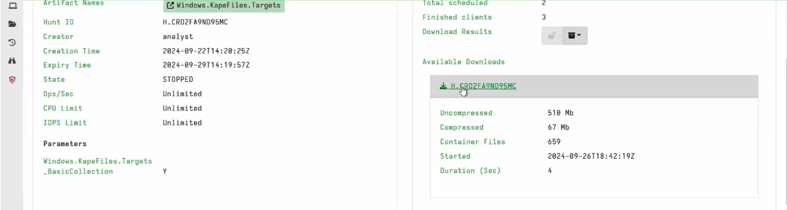

# Lab: Data Collection Techniques

> **Module:** Incident Response and Data Collection Techniques
> **Nature of this lab:** conceptual overview + course-demonstrated capabilities (not independently reproduced — see note)

## A note on scope

Like the [Velociraptor lab](../lab-velociraptor_EDR-analysis/README.md) it builds on, this topic was presented by the instructor as a walkthrough of what's *possible* rather than a case to fully reproduce. The KAPE-via-Velociraptor offline collector workflow shown below comes directly from the course material and wasn't independently built or run in this lab environment. It's documented here for completeness of the module, clearly separated from anything hands-on.

## Why data collection matters first

In forensics, a flawed or incomplete collection means there's nothing reliable left to analyze afterward — no amount of skill at the analysis stage can recover evidence that was never properly captured, or that was captured in a way that damages its integrity. This topic steps back from tool-specific workflows to the underlying principles.

## Fundamental sources of forensic evidence on Windows systems

- **Memory** — volatile; only exists while the system is running, so it must be captured live before shutdown or reboot destroys it.
- **Disk** — persistent, and itself split into several distinct evidence categories:
  - **NTFS artifacts** (`$MFT`, `$LogFile`, `$UsnJrnl`, etc. — covered hands-on in [Part 1](../../../Part-1-Jumpstart/README.md))
  - **Windows Registry**
  - **Windows Event Logs**
  - **Other Windows-specific artifacts** (prefetch, LNK files, jump lists, etc.)

## Two collection approaches

| Approach | Use case | Notes |
|---|---|---|
| **Live data collection** | Volatile evidence and files, without a lengthy full-drive duplication | Ideal for collection at scale across many endpoints |
| **Forensic duplication / disk imaging** | Full disk, partition, or logical volume | Live vs. offline; formats include raw (bit-for-bit copy), E01 (EnCase evidence file), AFF (Advanced Forensics Format) |

For disk imaging specifically, a **write blocker** sits between the source drive and the acquisition system to physically prevent any write operation from reaching the original evidence during capture — a core requirement for maintaining evidentiary integrity. The destination storage medium must always be equal to or larger than the source being imaged.

## KAPE via Velociraptor: the offline collector workflow

Velociraptor exposes an artifact — `Windows.KapeFiles.Targets` — that runs KAPE-style targeted collection directly on an endpoint through a live agent. For endpoints **without** a Velociraptor client installed (offline, air-gapped, or otherwise inaccessible), Velociraptor can instead generate a standalone **offline collector**: a preconfigured executable that can be transferred to the target system, run there with no prior setup, and will automatically collect exactly the artifacts specified — no live connection back to the Velociraptor server required during collection.

The workflow, as demonstrated in the course:

1. From the Velociraptor GUI, use **"Build an Offline Collector"** (accessible from the top toolbar / welcome screen).
2. Choose what to collect — course material shows Phill Moore's well-known **"Basic Collection"** KAPE target set: `$MFT`, `$LogFile`, `$J`, `$Boot`, registry hives (SAM, SECURITY, SOFTWARE, SYSTEM, NTUSER.DAT — including RegBack/transaction-log variants), Windows Event Logs, LNK files, Prefetch, Amcache, PowerShell console logs, and more.

   

3. Building generates a standalone executable tailored to the target OS.

   
   

4. Once run on the target, it produces a ZIP archive of collected artifacts — extractable and reviewable directly, or re-imported into Velociraptor via `Server.Utils.ImportCollection` (the same import mechanism used in the [Velociraptor lab](../lab-velociraptor_EDR-analysis/README.md)) for analysis through the normal GUI/notebook interface.

   

A completed run from the instructor's own environment illustrates the scale this can operate at: **510 MB uncompressed, collected down to 67 MB compressed, across 659 container files, completed in 4 seconds.**

This offline-collector pattern is the practical answer to a real constraint in enterprise DFIR: not every endpoint can or should run a persistent EDR agent, but forensically-sound, targeted collection still needs to happen quickly when an isolated or air-gapped machine is suspected of compromise.

## Key takeaway

Velociraptor and KAPE aren't competing tools here — they're complementary collection mechanisms serving different connectivity scenarios: Velociraptor's live artifact/VQL collection for connected endpoints at scale, and the KAPE-based offline collector for anything that isn't (or can't be) live-monitored. Both funnel back into the same analysis interface, which keeps the investigative workflow consistent regardless of how the evidence was originally gathered.

## Files in this folder

- `evidences/` — course-sourced screenshots illustrating the offline collector workflow, as noted inline
