# Lab: SIEM / Splunk Analysis

> **Module:** Incident Response and Data Collection Techniques
> **Tooling used:** Splunk Enterprise (self-hosted, Ubuntu DFIR workstation)
> **Evidence file:** `Splunk_logs_export.csv` (Sysmon + Windows PowerShell + Task Scheduler logs from Alice's workstation)

## Scenario

Building on the [PCAP analysis](../../01-security-operations/lab-pcap-analysis/README.md), which confirmed the delivery mechanism and C2 beaconing at the network layer, this lab pivots to **host-based evidence**. The goal is to reconstruct what actually happened *on* Alice's machine, using Sysmon and PowerShell logging exported into Splunk — without any prior knowledge of the log schema.

## Investigation

### 1. Getting oriented: what data do we actually have?

Before searching for anything specific, the first step is understanding the shape of the dataset itself:

```spl
source="Splunk_logs_export.csv" host="Ubuntu-dfir" | stats count by LogName
```

This surfaces the available log sources (Sysmon, Windows PowerShell, Task Scheduler, Security, Application, etc.) — some directly relevant, others noise. Rather than searching blind, the only concrete lead available at this point is the indicator already confirmed in the PCAP lab: the `w1ndowsupdate.com` domain.

### 2. Pivoting on the known indicator

```spl
source="Splunk_logs_export.csv" host="Ubuntu-dfir" *w1ndowsupdate.com*
```

A broad wildcard search (rather than a strict field match) is deliberate here — the goal at this stage is not to miss anything tangentially related. This returns a handful of events, including a Sysmon **Event ID 22 (DNS query)**: `firefox.exe`, running as user `alice`, resolving the malicious domain — directly corroborating the DNS typosquatting already identified at the network layer.

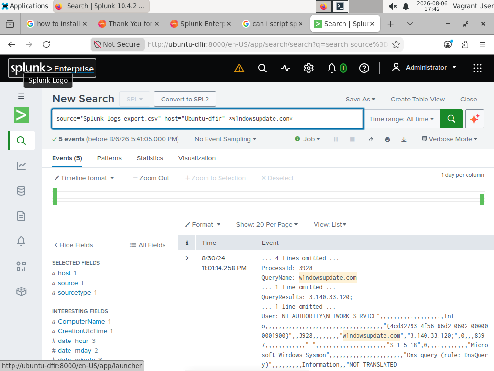

Alongside it, a Sysmon **Event ID 15 (file stream created)**: `firefox.exe` writing `update.exe.hta` to `C:\Users\alice\Downloads\`, with the `ReferrerUrl` and `HostUrl` fields both pointing back to the malicious domain. This single event answers *who* downloaded the file, *when*, and *how* — but not yet what happened to it afterward.

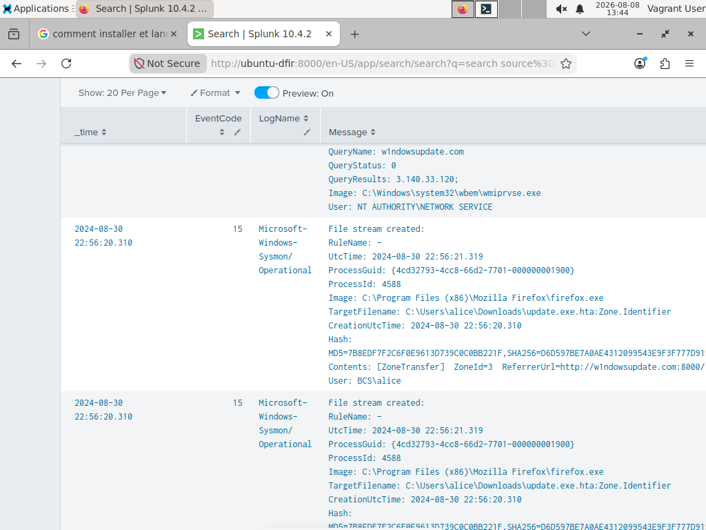
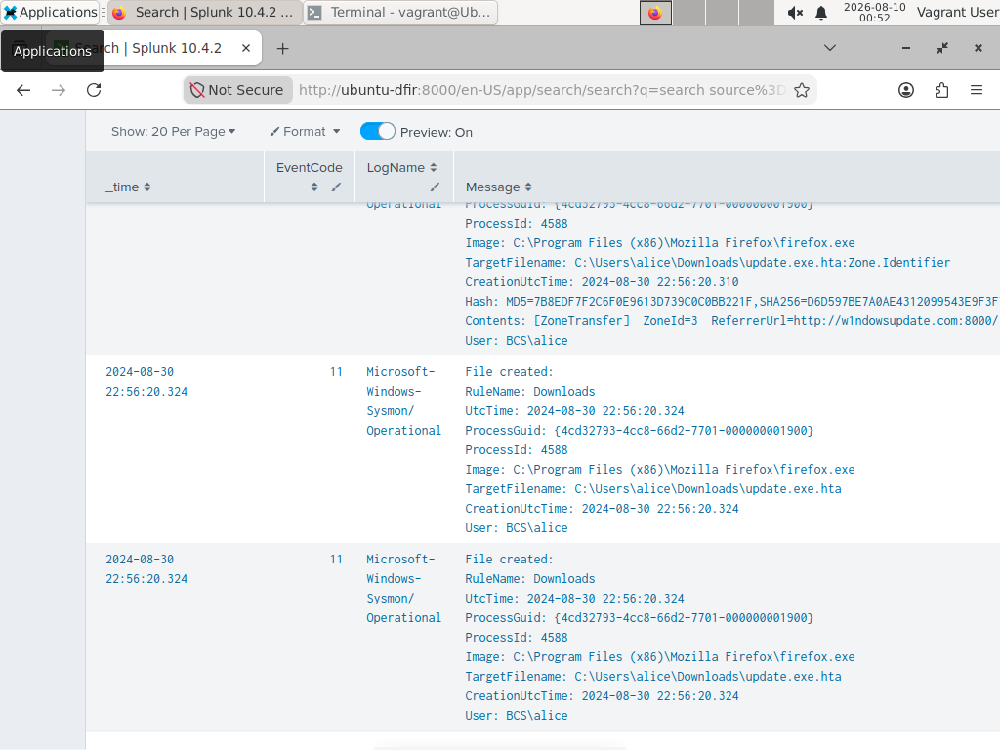

### 3. From download to execution

Searching specifically for the downloaded file's activity:

```spl
source="Splunk_logs_export.csv" host="Ubuntu-dfir" *update.exe.hta*
| reverse
| table time, EventCode, LogName, Message
```

> **Note on data quality:** this search initially returned double the expected event count. After investigation, this turned out to be a duplication artifact from importing the CSV twice into Splunk, not a real duplication of activity on the host. Re-importing cleanly resolved it — a useful reminder to sanity-check event counts before drawing conclusions from them.

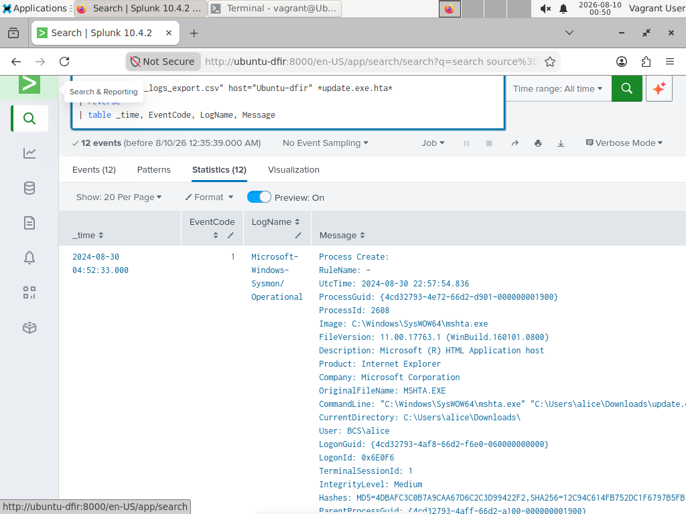

The key finding here is a Sysmon **Event ID 1 (process create)**: shortly after the file write, `update.exe.hta` is executed. The process tree shows `explorer.exe` as the parent — meaning Alice was logged on and double-clicked the file directly — with the file handed off to **`mshta.exe`**, the legitimate Windows binary that executes HTML Application files. This maps directly to **MITRE ATT&CK T1218.005 (Mshta)**, a well-documented "living-off-the-land" technique for proxying script execution through a trusted Microsoft binary.

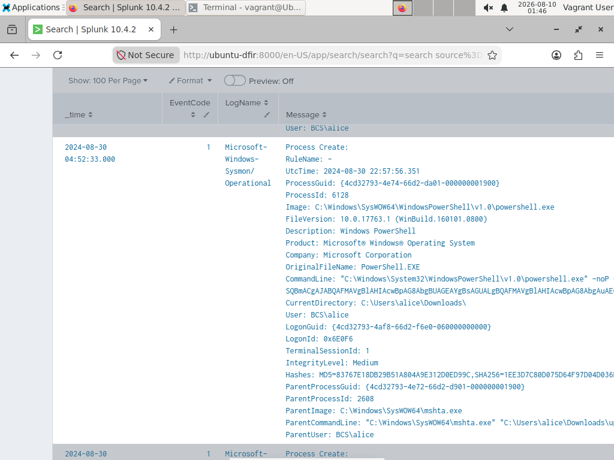
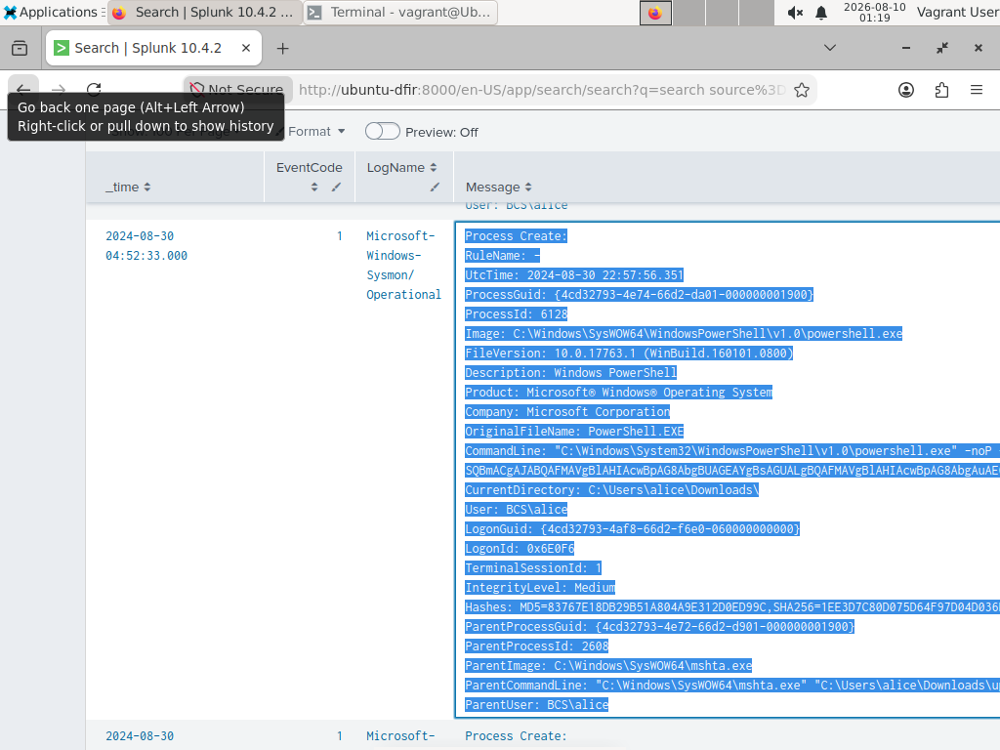

### 4. Following the process chain

Immediately after, a second process creation event shows `mshta.exe` spawning `powershell.exe` (ProcessId `6128`) — the same encoded command line already decoded in the PCAP lab. Having the `ProcessGuid` at this point is what makes the rest of the investigation possible: it becomes the thread to pull to follow everything this specific PowerShell instance does or spawns.

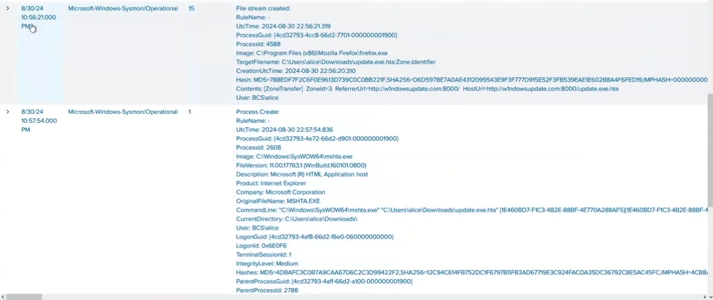

```spl
source="Splunk_logs_export.csv" host="Ubuntu-dfir"
(ProcessGuid="{4cd32793-4e72-66d2-d901-000000001900}" OR ParentProcessGuid="{4cd32793-4e72-66d2-d901-000000001900}")
| reverse
| table time, EventCode, LogName, Message
```

Searching on both `ProcessGuid` and `ParentProcessGuid` together is intentional: the attacker's script could run commands directly under this process, or spawn children — either direction matters. This single process (PID 6128) alone generates **1,761 events in roughly 22 minutes**.

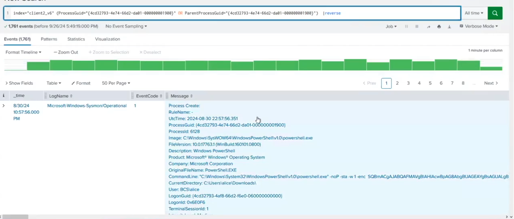

### 5. Confirming PowerShell activity via PSScriptPolicyTest

Among those events, a telltale artifact: a `__PSScriptPolicyTest_*.ps1` file created under the user's `Temp` folder. This is a well-known PowerShell behavior — whenever a script block executes, PowerShell silently drops a short-lived policy test file. Its presence (even though the file itself is transient and harmless) is a reliable indicator that PowerShell script execution occurred, independent of whatever the script's actual payload was.

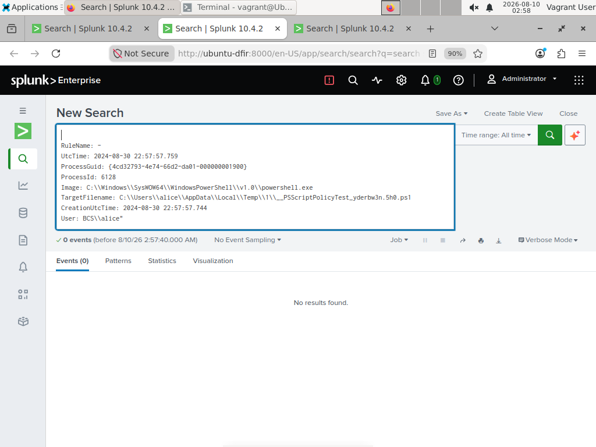

### 6. Confirming the beacon, host-side

Filtering the same process for **Event ID 3 (network connection)** confirms, from the host's perspective, the same beaconing pattern already observed in the PCAP: repeated outbound connections to `3.140.33.120:9001`, roughly once per second — a textbook C2 polling cadence.

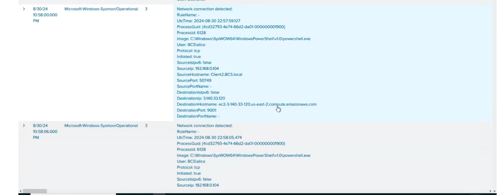
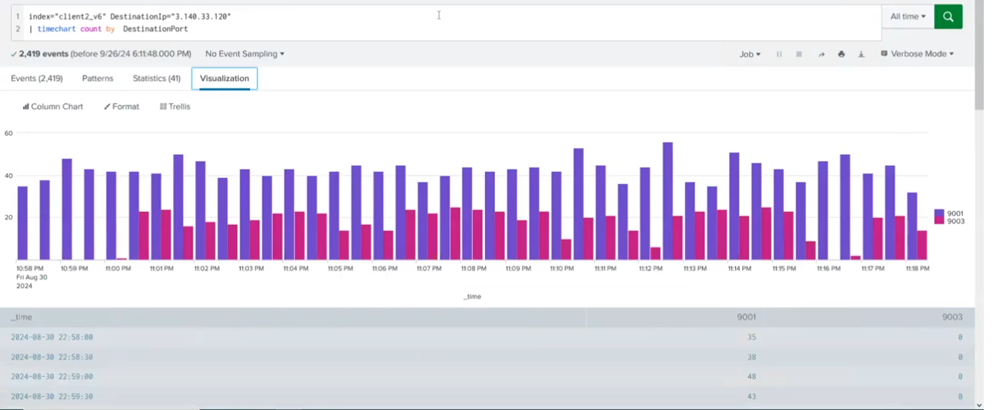

### 7. Persistence: the registry Run key

Excluding network noise (`EventCode!=3`) to focus on what else this process did surfaces a Sysmon **Event ID 13 (registry value set)** — and this is where the investigation shifts from "delivery" to "persistence":

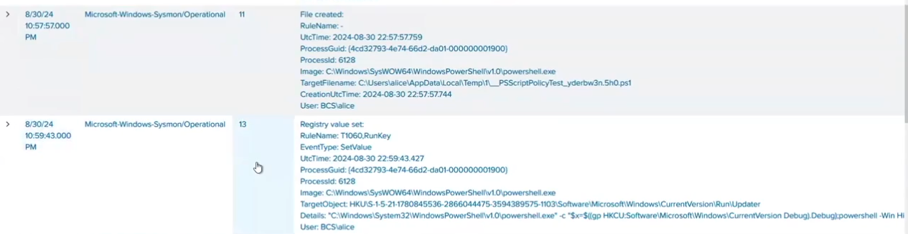
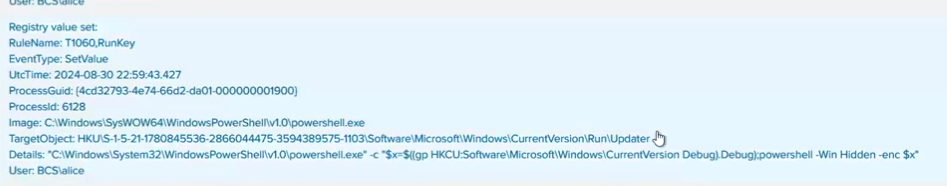

The script writes to `HKU\...\Software\Microsoft\Windows\CurrentVersion\Run\Updater` — the classic **Run key persistence mechanism** (auto-executed at user logon). The command stored there doesn't contain the payload directly; instead it reads a *second*, deliberately misleadingly-named registry value — `CurrentVersion\Debug` — and pipes its contents into a hidden PowerShell process. Storing the payload under a "Debug" key is a small but effective obfuscation choice: it looks unremarkable to a cursory registry review.

### 8. A second PowerShell instance: privilege escalation

Continuing to search the same process tree for the `SQBmACgAJABQAFMAV*` string (the Base64 prefix consistently seen across every encoded PowerShell command in this incident) surfaces further activity, including Windows PowerShell operational logs — **Event ID 400** (engine start) and **Event ID 4104** (script block logging), which captures the full text of executed script blocks.

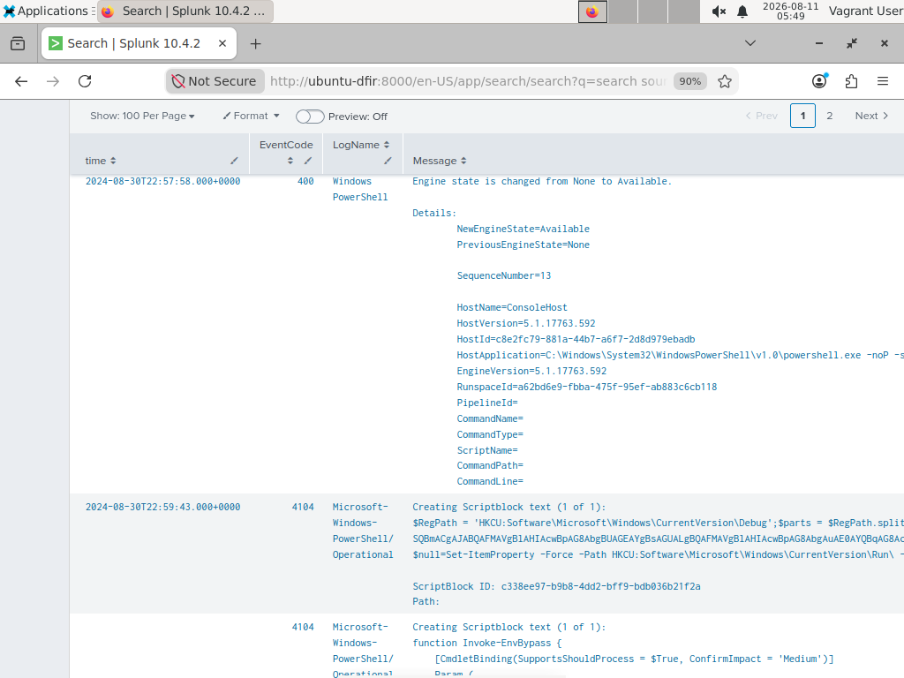

Digging into the 4104 content reveals something beyond simple execution: the script defines an `Invoke-EnvBypass` function implementing a known **UAC bypass technique** — abusing the trusted, auto-elevated scheduled task `\Microsoft\Windows\DiskCleanup\SilentCleanup`. The technique works by hijacking an environment-variable expansion (`%windir%`) that the auto-elevated task reads from the registry, pointing it at the attacker's own payload instead of the real Windows directory, then triggering the task via `schtasks /Run`. Because the task already runs elevated by design, whatever it "expands" as `%windir%` executes with **High integrity**, without ever prompting the user via UAC.

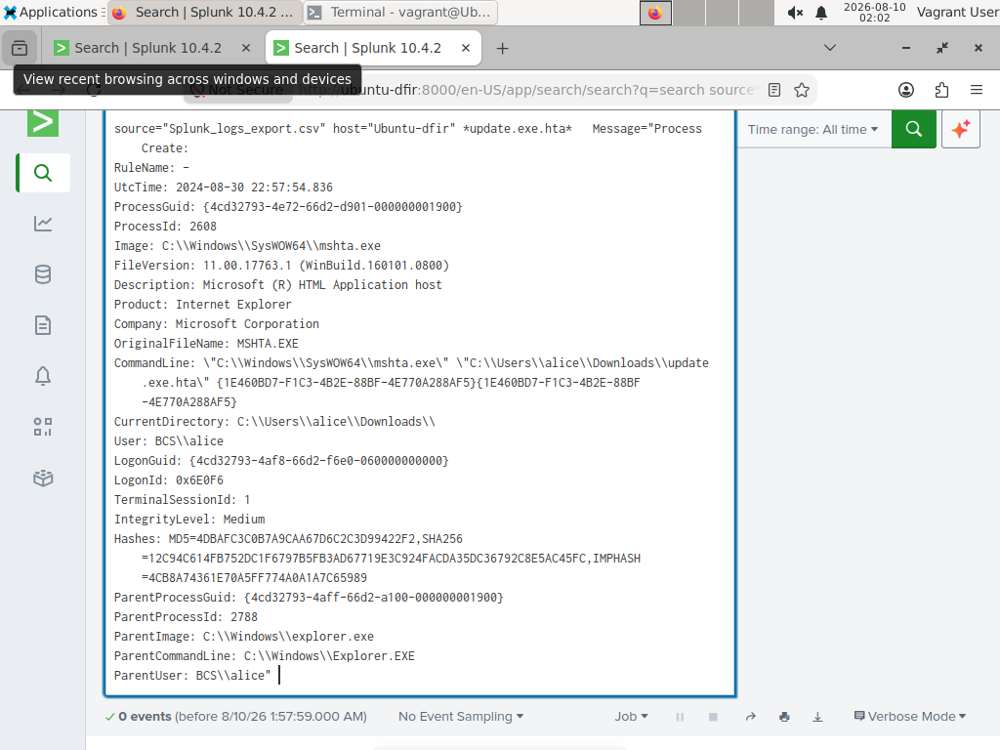
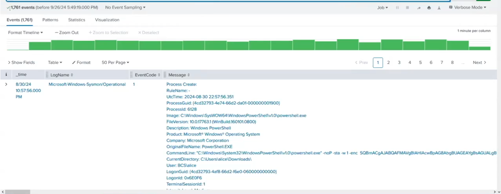

```spl
source="Splunk_logs_export.csv" host="Ubuntu-dfir"
(ProcessGuid="{4cd32793-4f07-66d2-fc01-000000001900}" OR ParentProcessGuid="{4cd32793-4f07-66d2-fc01-000000001900}") EventCode!=3
| reverse
| table time, EventCode, LogName, Message
```

Pivoting on the new process spawned by this bypass (10 events, no network activity of its own) confirms the escalation directly: this new PowerShell instance runs at **`IntegrityLevel: High`**, compared to `Medium` for the original process — hard evidence that the UAC bypass succeeded.

.png)
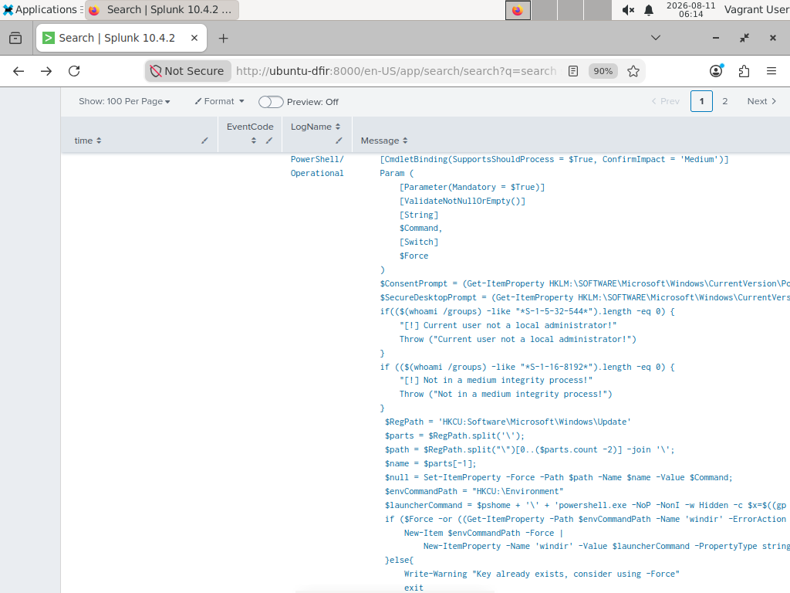

### 9. Post-escalation: recon, persistence (again), and staging

With elevated privileges in hand, the process tree shows a shift in behavior:

- **`systeminfo.exe`** execution — basic host reconnaissance
- A **new scheduled task**, again named `Updater`, created for logon-triggered persistence — this time registered under the `S-1-5-18` SID (**SYSTEM**), confirming the task now runs with the elevated context obtained via the bypass
- Most notably, a `powershell.exe` process (High integrity) running:

  ```
  Compress-Archive -Path C:\users\alice\documents -DestinationPath C:\temp\1.zip
  ```

  Alice's Documents folder is staged into a zip archive under `C:\temp\` — classic **data staging** ahead of exfiltration.

  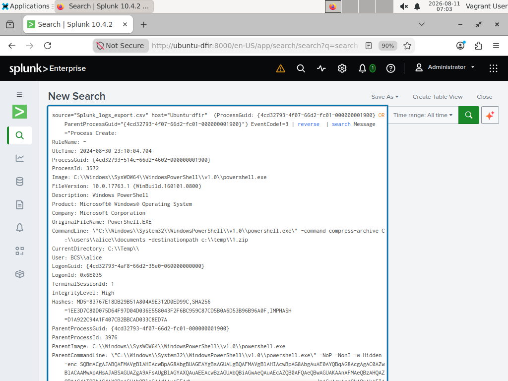

- Shortly after, a follow-up process **deletes** that same zip file — consistent with the attacker cleaning up staged data once it's presumably been exfiltrated elsewhere (the exfiltration channel itself wasn't further traced in this lab; the deletion is the clearest remaining evidence of staging intent).

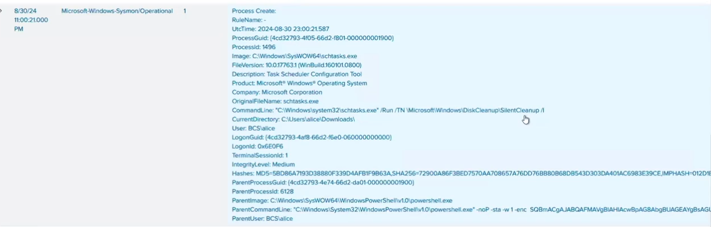

### 10. Cross-checking persistence without Sysmon

As a sanity check on the persistence findings — and to think about what would still be visible *without* Sysmon in place — searching Task Scheduler operational logs directly:

```spl
source="Splunk_logs_export.csv" host="Ubuntu-dfir" EventCode=106
| reverse
| table time, EventCode, LogName, Message
```

Three events: two legitimate Firefox-related scheduled tasks, and the malicious `Updater` task registered by the elevated process. Task Scheduler logs alone confirm *that* persistence was established, but not *what* the task actually does — for that, Sysmon's process and registry visibility (or direct inspection of the referenced file/registry value) remains necessary.

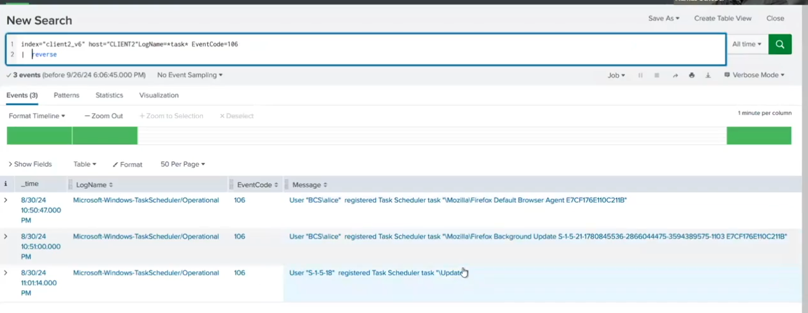

### 11. Exploring Splunk's analytical features

Beyond straight event retrieval, a couple of quick pivots demonstrate Splunk's value for hunting more broadly:

```spl
EventCode=1 LogName=*sysmon* Image!=*firefox*
| stats count by CommandLine
```

Stacking every non-Firefox command line executed on the host in one view (45 distinct entries) surfaces the full spread of activity at a glance — PowerShell invocations, `whoami`, the analyst's own tools (FTK Imager, Wireshark), and the malicious `mshta.exe` call, all side by side. This kind of frequency/stacking analysis is a core SOC technique for spotting outliers in noisy environments.

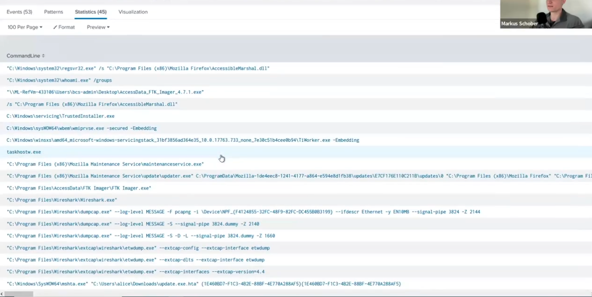

```spl
EventCode=1 DestinationIp="3.140.33.120"
| timechart count by DestinationPort
```

Visualizing all network connections to the C2 IP over time, broken down by destination port, gives a clean picture of the beaconing cadence directly inside Splunk — reinforcing what was already seen in Wireshark, but from the host log perspective.

## Attack chain summary (host-based view)

| Stage | Technique | Evidence (Sysmon Event ID) |
|---|---|---|
| Delivery | `firefox.exe` downloads `update.exe.hta` | 15 (File stream created) |
| Execution (stage 0) | `explorer.exe` → `mshta.exe` (T1218.005) | 1 (Process create) |
| Execution (stage 1) | `mshta.exe` → `powershell.exe -enc ...` | 1 (Process create) |
| C2 | Beaconing to `3.140.33.120:9001` | 3 (Network connection) |
| Persistence #1 | Run key `CurrentVersion\Run\Updater` | 13 (Registry value set) |
| Payload storage | Hidden under `CurrentVersion\Debug` | 13 (Registry value set) |
| Privilege escalation | UAC bypass via `SilentCleanup` scheduled task hijack | 4104 (Script block logging) |
| Persistence #2 | Scheduled task `Updater`, SYSTEM context | 106 (Task Scheduler) |
| Recon | `systeminfo.exe` execution | 1 (Process create) |
| Data staging | `Compress-Archive` on Alice's Documents | 1 (Process create) |
| Anti-forensics | Deletion of staged archive | 1 / 23 (Process create / File delete) |

## Detection & Mitigation

**Detection opportunities:**
- **Sysmon Event ID 1 + parent/child process chains**: the `explorer.exe → mshta.exe → powershell.exe` chain is one of the highest-confidence detection patterns in Windows endpoint monitoring. Any EDR/SIEM rule alerting on `mshta.exe` spawning `powershell.exe` would have caught this at the very first stage.
- **PSScriptPolicyTest artifacts**: while not malicious on their own, their presence combined with an unusual parent process is a solid secondary signal that a script executed outside of normal admin activity.
- **Registry Run key monitoring**: Sysmon Event ID 13 on `CurrentVersion\Run` (and `RunOnce`) is cheap to collect and high-value — legitimate software rarely writes to these keys outside of installation.
- **UAC bypass detection**: the `SilentCleanup` scheduled-task abuse is a well-documented technique; monitoring for unexpected `schtasks /Run` invocations targeting that specific task, or for integrity-level jumps within a single process tree (Medium → High without a UAC prompt event), is a known high-fidelity detection rule.
- **Compress-Archive on user document folders followed by deletion**: unusual for normal user or admin behavior, and a strong data-staging indicator when it targets a personal Documents folder rather than a system location.

**Mitigation / hardening:**
- Constrained Language Mode or AppLocker/WDAC policies restricting PowerShell execution from unexpected parent processes (especially `mshta.exe`).
- Harden or monitor the specific auto-elevated scheduled tasks (like `SilentCleanup`) known to be abused for UAC bypass; Microsoft has published guidance on restricting their abuse.
- Apply least-privilege principles so that a compromised user session has fewer auto-elevated tasks available to hijack in the first place.
- Centralize and alert on Windows PowerShell Script Block Logging (Event ID 4104) — as seen here, it captured the entire UAC bypass function in cleartext, which was the single most valuable artifact in this whole investigation.

## A note on the investigation process

This lab took considerably longer than its ~1 hour of course video — closer to a week of iterative searching, re-reading Sysmon field documentation, and correcting course (including the CSV duplication issue caught in step 3). That's a fair reflection of what real SIEM work looks like: the value isn't in knowing the right query upfront, it's in following one confirmed lead (the malicious domain) into an increasingly specific chain of evidence, one `ProcessGuid` at a time.

## Files in this folder

- `evidences/` — all Splunk screenshots referenced above
- `evidences/other-4104.ps1` — extracted content of a captured Script Block Logging event
- `splunk-quick-reference-guide.pdf` — SPL syntax reference used throughout this lab
- `MSHTA.md` — supplementary notes on the `mshta.exe` living-off-the-land technique (T1218.005)
