# Lab: EDR / Velociraptor Analysis

> **Module:** Incident Response and Data Collection Techniques
> **Tooling used:** Velociraptor v0.77.2 (self-hosted, standalone GUI mode)
> **Nature of this lab:** exploratory — see note below

## A note on scope

Unlike the [PCAP](../../01-security-operations/lab-pcap-analysis/README.md) and [Splunk](../lab-splunk_SIEM-analysis/README.md) labs, this module was explicitly framed by the instructor as a capability overview rather than a guided investigation — a chance to see what Velociraptor *can* do, not a step-by-step case to fully reproduce. In practice, part of the demo (in particular the `Windows.KapeFiles.Targets` hunt) wasn't reproducible in this lab environment — that artifact wasn't present in this Velociraptor build's default artifact list. This is left as an open item rather than papered over. What follows documents what was actually run and observed locally.

## What is an EDR, and how does it differ from a SIEM?

An EDR (Endpoint Detection and Response) tool provides continuous monitoring and collection of endpoint data to detect, investigate, and respond to threats — identifying malicious activity directly on endpoints, containing and mitigating it, and helping scope the impact of an incident. This differs architecturally from a SIEM: rather than centralizing pre-shipped logs for correlation, an EDR like Velociraptor pushes queries *to* the endpoints themselves and pulls results back on demand.

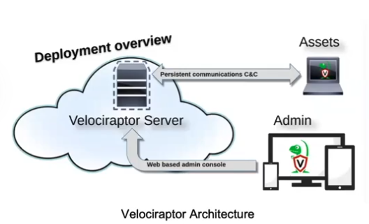

Velociraptor's core mechanism is **VQL** (Velociraptor Query Language), which lets an analyst run targeted forensic queries or full "hunts" (a query/artifact run across one or more endpoints) and retrieve the results centrally — live, at scale, without needing to touch each machine manually.

## What was actually done locally

No live Velociraptor client was deployed against a real endpoint in this lab — the focus was on standing up the server in standalone GUI mode and exploring its collection/hunt workflow using data collected earlier in the investigation.

### 1. Standing up Velociraptor

Downloaded the Linux release directly and launched the built-in GUI mode:

```bash
./velociraptor-v0.77.2-linux-amd64 gui
```

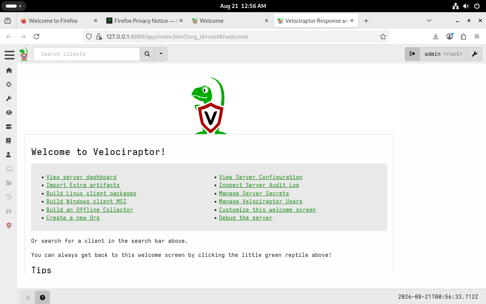

### 2. Importing an existing collection

Rather than running a live hunt against a real Windows endpoint (not available in this setup), Velociraptor supports importing previously-collected offline data so it can be analyzed through the same interface as a live collection. The workflow:

1. Copy the collection files to a directory accessible by the Velociraptor process (`~/DFIR` in this case).
2. In the GUI, navigate to **Server Artifacts** → **+ (New Collection)** → search for and select `Server.Utils.ImportCollection`.

   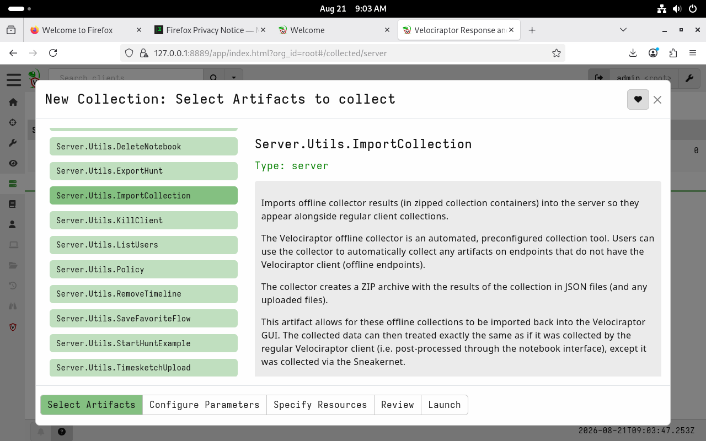

3. Configure the parameters: the `Path` to the `.zip` collection file, and an optional `Hostname` label (used `Forensic` here for clarity).

   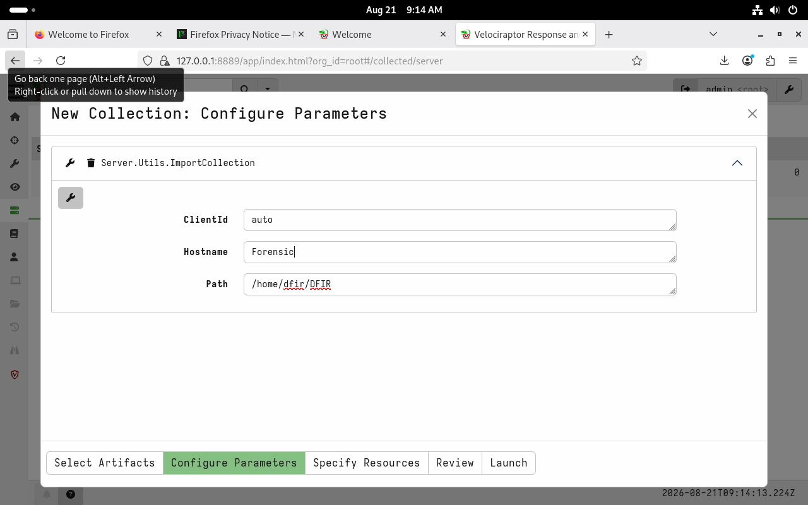

4. Review and launch the import.

   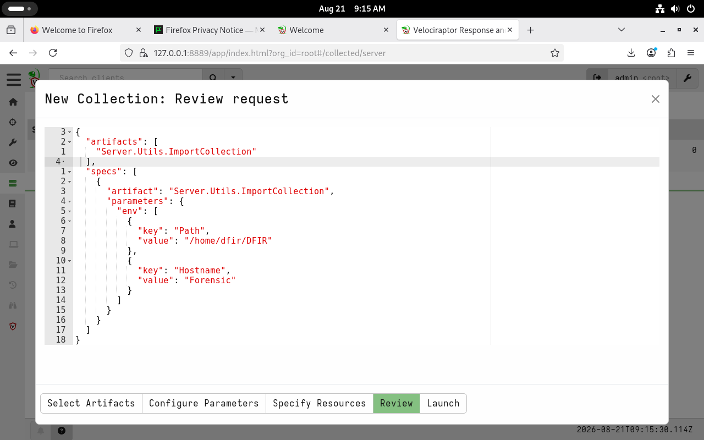

Once the import flow completes, the imported data appears as a **virtual client** under "Show All Clients" — from there it's possible to browse Collected Artifacts, Uploaded Files, and use the Notebook interface to run VQL queries against the imported data exactly as if it had come from a live agent.

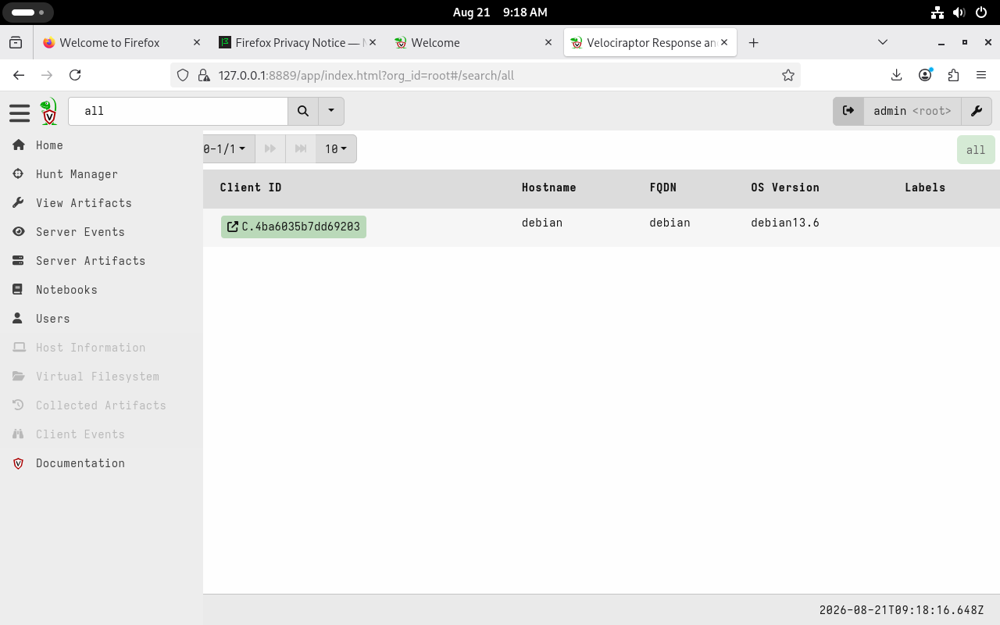

### 3. Exploring the Hunt creation workflow

Separately, walked through Velociraptor's hunt-creation flow to understand the mechanism, without a live target to actually execute against:

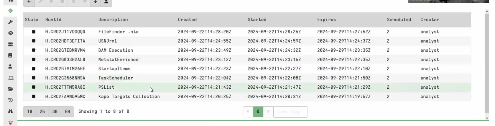
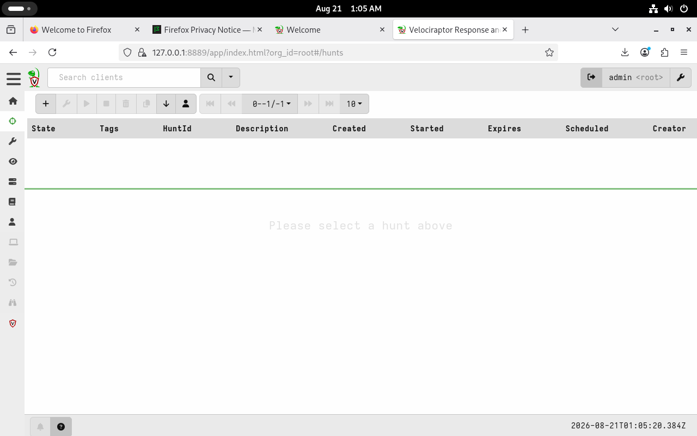

Creating a hunt starts with a description and scope (which clients/orgs to target):

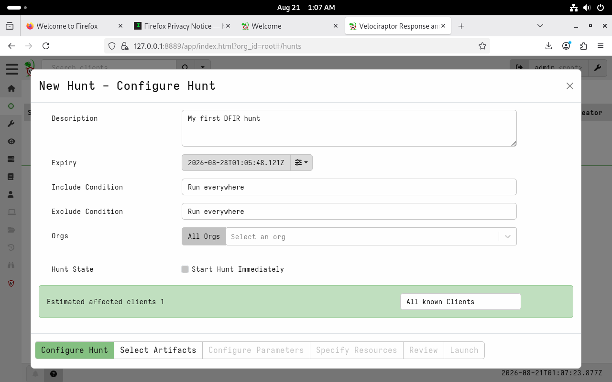

Artifact selection offers a large library across Windows, Linux, and macOS — each with a description of exactly what it collects and why, which is genuinely useful for understanding forensic scope before running anything against a real system:

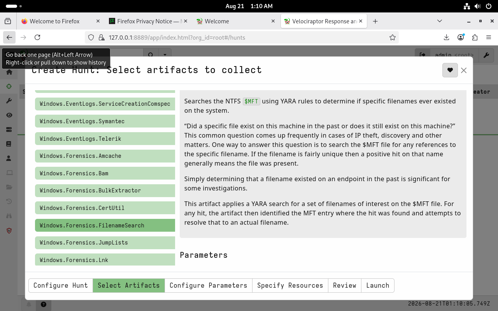

Resource limits (CPU, IOPS, max execution time, max rows/upload size) can be tuned per collection — relevant for not overwhelming a production endpoint during a live hunt:

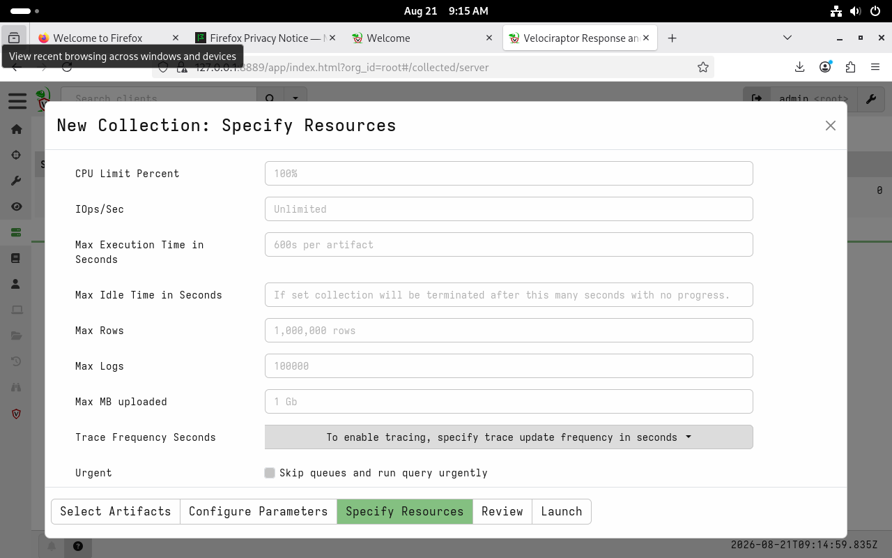

**What didn't reproduce successfully:** attempting to follow the course's `Windows.KapeFiles.Targets` hunt wasn't possible as-is — that artifact wasn't present in this Velociraptor build's artifact list. A next step would be confirming whether it needs to be imported separately as a custom/third-party artifact pack rather than being bundled by default. The mechanics of that specific hunt — and the KAPE offline-collection workflow it demonstrates — are documented from the course material in [`../lab-collection-data/README.md`](../lab-collection-data/README.md), since that's really a data-collection technique rather than a Velociraptor-specific feature.

## Detection & Mitigation — a different angle for this module

Unlike the PCAP and Splunk labs, this module isn't itself an investigation of Alice's compromise — it's about the *tooling* that would support one. So instead of a per-technique detection table, the relevant takeaway is more about SOC posture:

- **EDR coverage is what would have made this entire incident dramatically faster to scope.** Everything painstakingly reconstructed by hand in the Splunk lab — process trees, registry persistence, the UAC bypass — is exactly the kind of data an EDR agent collects natively and continuously, without needing to know in advance which log source or `ProcessGuid` to search for.
- **Artifact-driven collection (VQL) is more defensible than ad-hoc scripts.** Using well-known, documented artifact definitions (rather than a bespoke PowerShell collection script) makes an investigation's methodology easier to justify and reproduce later — relevant for chain-of-custody and any findings that might end up in a legal or HR context.
- **Offline import capability matters for constrained environments.** Being able to import a `.zip` collection into the same GUI/notebook interface used for live hunts (as done here) means the analysis workflow stays consistent whether or not a live agent was ever deployed — useful when working with evidence gathered by another means (e.g., disk imaging, KAPE) rather than a live Velociraptor client.

## Files in this folder

- `evidences/` — all Velociraptor screenshots referenced above
