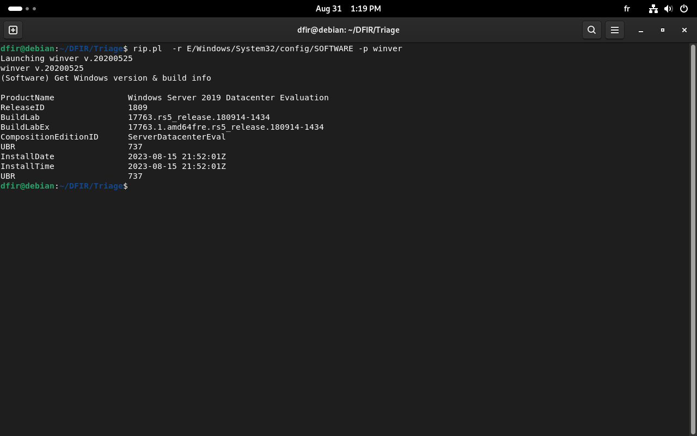
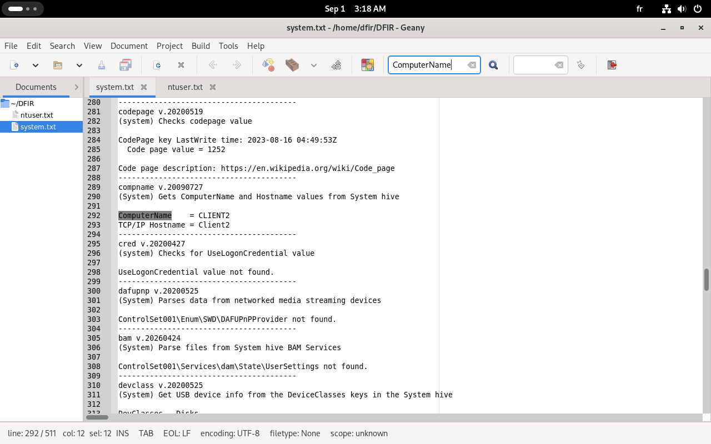

# Lab: Disk Analysis

> **Module:** DFIR Foundations and Techniques — Applied Forensic Analysis
> **Evidence:** disk triage collection (`E:\` mount — `Users\alice\NTUSER.dat`, `Windows\System32\config\{SYSTEM,SOFTWARE,SAM}`, `UsrClass.dat`)
> **Tools used:** RegRipper 3.0, manual hive review
> **Status:** paused after initial triage — see [Status & Limitations](#status--limitations)

## Overview

Disk analysis picks up where memory analysis leaves off: instead of a volatile snapshot, this is the persistent state left behind on the file system and in the registry hives. The relevant artifact categories, per the course cheat sheet:

- **Registry files** — `UsrClass.dat` (user-specific settings), `NTUSER.DAT` (per-user preferences/autostart), `SYSTEM` (system-wide config), `SOFTWARE` (installed software/app settings)
- **File system metadata** — MFT (Master File Table), UsnJrnl (Update Sequence Number Journal, tracks file changes)
- **Event logs** — `.evtx` files (already covered from the log/SIEM angle in the Splunk lab, so not re-walked here)
- **Browser artifacts** — Firefox history/cookies


The goal at this stage is identification (what system is this, what artifacts are present) before diving into evidence of execution and persistence specifically.

## Tooling

RegRipper 3.0 applies known plugins against a given registry hive to pull out specific, well-understood artifacts (installed software, USB history, run keys, etc.) rather than requiring a manual walk through `regedit`. Since the Linux build ships with a Windows-oriented shebang line, installation was scripted:

```bash
sudo ./regripper_install.sh
```

This clones the official repo, rewrites the shebang to `#!/usr/bin/env perl`, and symlinks `rip.pl` into `/usr/local/bin` for global use. The full list of available plugins used for reference is exported in `plugins.csv`.

## What was run

**System identification**, targeting the `SOFTWARE` hive with a single known plugin:

```bash
rip.pl -r E/Windows/System32/config/SOFTWARE -p winver
```

Output confirmed the disk image matches the same host profiled in the memory lab:

```
ProductName            Windows Server 2019 Datacenter Evaluation
ReleaseID              1809
BuildLab               17763.rs5_release.180914-1434
InstallDate            2023-08-15 21:52:01Z
```



Cross-referencing against the triage summary table (host `CLIENT2`, IP `192.168.0.104`, owner `BCS\Alice`, Pacific Standard Time, AV settings for Defender all disabled — `DisableAntiSpyware`, `DisableBehaviorMonitoring`, `DisableRealtimeMonitoring` all set to `1`) — a relevant finding on its own: Defender's real-time protections were disabled before this triage was even pulled, which is consistent with the attacker having admin-level access (per the privilege escalation stage of the incident) and taking a deliberate step to reduce detection.

Confirmed against the `SYSTEM` hive directly as well, running the full plugin set (`-a`) rather than one at a time:

```bash
rip.pl -r <path>/SYSTEM -a > system.txt
rip.pl -r <path>/NTUSER.DAT -a > ntuser.txt
```

`-a` runs every plugin applicable to that hive type rather than requiring each one to be picked manually — useful for not missing anything, at the cost of a lot of noise in the output. The `compname` plugin (inside `system.txt`) independently confirmed the hostname:

```
ComputerName     = CLIENT2
TCP/IP Hostname  = Client2
```



## Status & Limitations

Full-plugin (`-a`) output was also generated against `SOFTWARE`, `SAM`, `UsrClass.dat`, and `NTUSER.dat`, but going further into evidence-of-execution and persistence artifacts (Run keys, UserAssist, Shimcache/Amcache, Prefetch correlation, etc.) was paused for two concrete reasons:

- **Mixed encoding in RegRipper's output.** Several plugin outputs interleave Windows (UTF-16LE) and Linux-native (UTF-8/ASCII) encoded strings in the same run, since RegRipper prints REG_SZ/REG_BINARY values largely as-is rather than normalizing them. Attempts to force a consistent encoding on the output (`iconv`, re-piping through different tools) did not produce clean, reliably parseable text.
- **No reference command list from the course.** Unlike the PCAP and Splunk labs, this module's instructor demonstration jumps directly into interpreting results without showing which specific plugins were run against which hive — so it isn't possible to confirm whether an artifact that doesn't appear in this triage is genuinely absent, or simply wasn't covered by whichever plugin(s) the instructor actually used.

The theoretical grounding for this artifact set (what each hive contains, what each highlighted artifact means) is solid — confirmed independently via the DFIR Foundations knowledge assessment (100% on the "Disk and Memory Analysis" category). What's paused is the *practical* extraction of deeper artifacts against this specific triage, pending either a cleaner encoding workaround or access to the instructor's own command sequence.

## Files in this folder

- `regripper_install.sh` — automated Linux install script for RegRipper 3.0
- `plugins.csv` — exported list of available RegRipper plugins, used as a reference during triage
- `evidences/` — screenshots referenced above

## Next Step

Revisit once a clean approach to RegRipper's mixed-encoding output is found, or once the instructor's own attack-replication repository (see project `RESOURCES.md`) makes it possible to generate matching triage data end to end.
