# Lab: Memory Analysis

> **Module:** DFIR Foundations and Techniques - Memory Analysis
> **Evidence file:** `memdump.mem` (Windows Server 2019, build 17763)
> **Tools used:** Volatility 3, `strings`, bulk_extractor, custom Python automation

## Overview

RAM contains volatile data that reflects what an attacker is actively doing on a system - running processes, open network connections, injected code - none of which necessarily survives a reboot or shows up on disk. A memory dump is a binary snapshot of that state at capture time; a pagefile can retain additional artifacts swapped out of RAM.

This lab investigates `memdump.mem` end to end: confirming the image, walking the process tree, pulling command lines, checking live connections, then falling back to raw string carving and bulk pattern extraction once the structured plugins ran out of leads.

## 1. System identification

First step, always: confirm the image is valid before running anything else.

```bash
vol -f memdump.mem windows.info
```

Confirms OS version, build, and architecture, and shows what memory layer/symbols Volatility resolved. Here: Windows Server 2019, build 17763, `NtProductServer`, capture time `2024-08-30 23:22:50 UTC`.

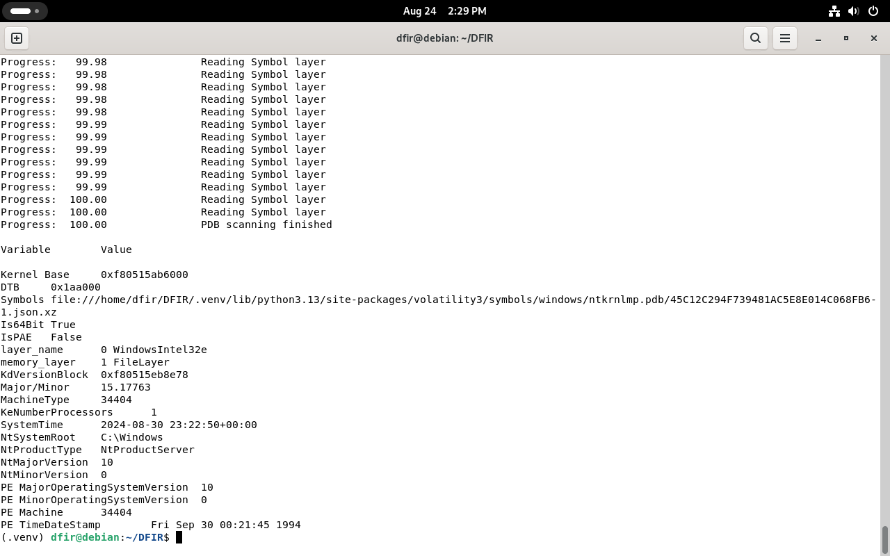

## 2. Process tree

```bash
vol -f memdump.mem windows.pstree > pstree.txt
```

Lists processes as a parent/child hierarchy, useful for spotting an unusual spawn (e.g. `winlogon.exe → cmd.exe`). Here, the tree showed `explorer.exe → firefox.exe (×N) → updater.exe`, plus `FTK Imager.exe` (the acquisition tool itself) and the expected Splunk/Sysmon services - nothing jumps out from the tree shape alone.

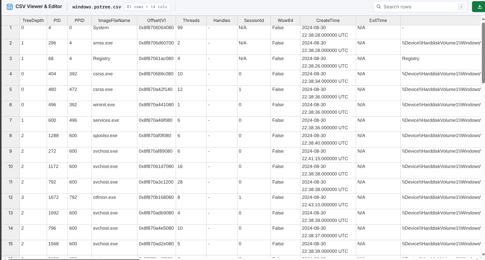
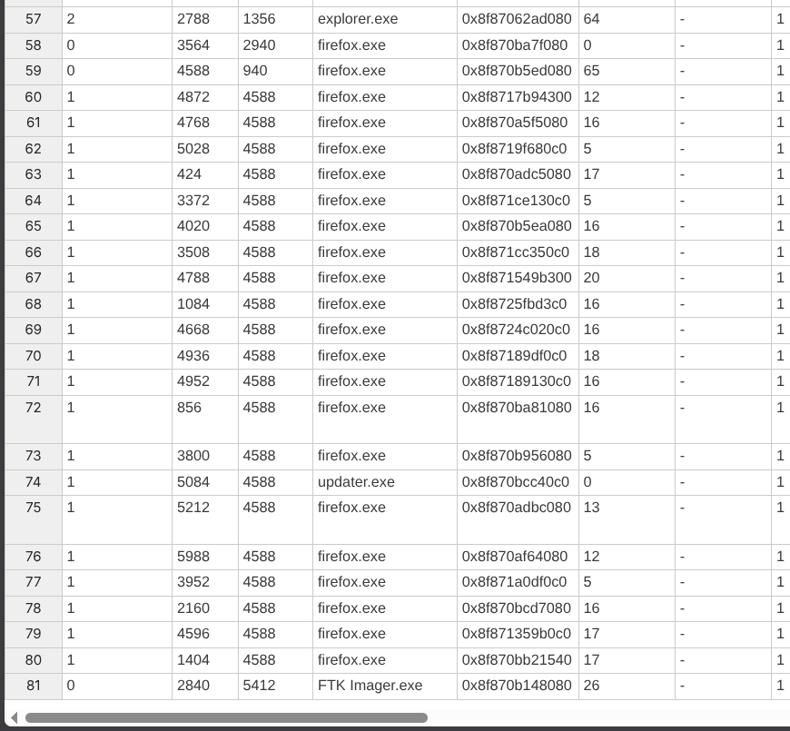

## 3. Command line review

```bash
vol -f memdump.mem windows.cmdline
```

`pstree` shows *what* ran; `cmdline` shows *how* - arguments, encoded payloads, flags. This is where the lab actually broke open: a command line masquerading as the Splunk forwarder (`splunk-powershell.exe --ps2 ...`) writes a `Run` key named **`Updater`** that re-launches `powershell.exe -enc <base64>`, with an inline note in the same string: *"Registry persistence established using listener http_9003 stored in HKCU:Software\Microsoft\Windows\CurrentVersion\Debug"*. A second hidden invocation reads a payload back out of a registry value (`HKCU:Software\Microsoft\Windows Update).Update`) and re-executes it, followed by `cleanmgr.exe /autoclean`.

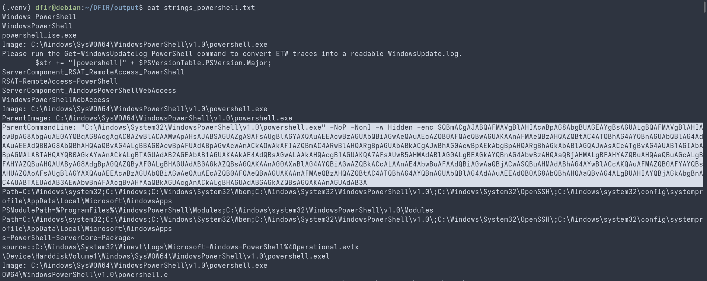
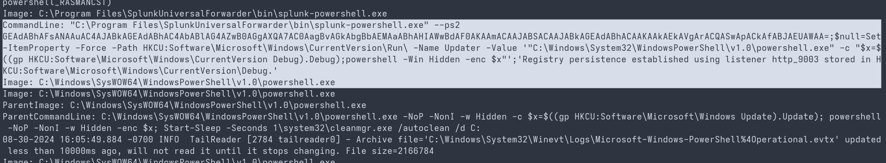

## 4. Network connections

```bash
vol -f memdump.mem windows.netscan
```

Extracts active connections directly (IP, port, PID) rather than relying on raw string search. Filtered out `127.0.0.1`, internal SMB (445), and the Splunk forwarder port (9997); what remained were unremarkable outbound HTTPS connections to public IPs.

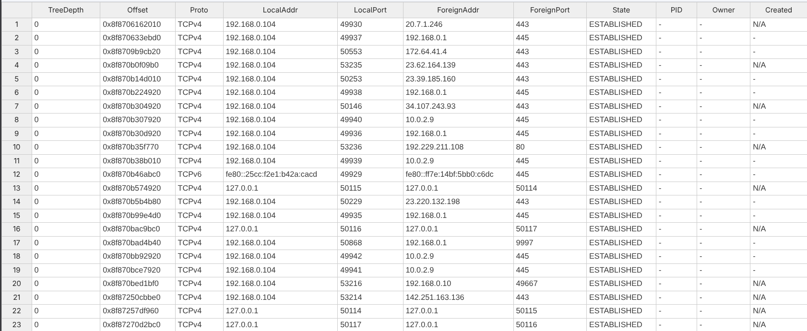

The attacker IP identified in the PCAP lab (`3.140.33.120`) was **not** present in this particular snapshot - noted as a negative result rather than left out, since it's a useful reminder that `netscan` only shows connections live at capture time.

## 5. Raw string extraction

`windows.strings` needs a pre-generated string list as input, so the Linux `strings` utility runs first:

```bash
strings memdump.mem > raw_strings.txt
```

This produces a very large flat text file, which is then filtered down with `grep` for specific leads rather than read in full.

**PowerShell activity:**
```bash
grep -i powershell raw_strings.txt > strings_powershell.txt
```
Recovered the full base64-encoded, hidden-window PowerShell command line (`-NoP -NonI -w Hidden -enc ...`).

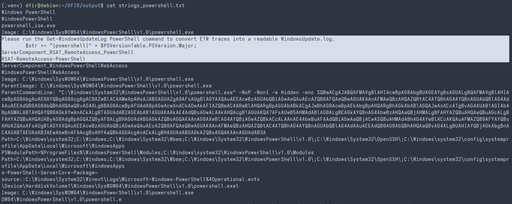

**IP address candidates:**
```bash
grep -Eo '([0-9]{1,3}\.){3}[0-9]{1,3}' raw_strings.txt > strings_IP.txt
```
`-E` enables extended regex, `-o` prints only the matching substring. The pattern matches four dot-separated 1–3 digit groups - it does **not** validate the 0–255 range, so a string like `999.999.999.999` would still match. Sorted and deduplicated:
```bash
sort strings_IP.csv | uniq | wc -l
```
→ **1,238 unique IP-shaped strings**, most of them noise.

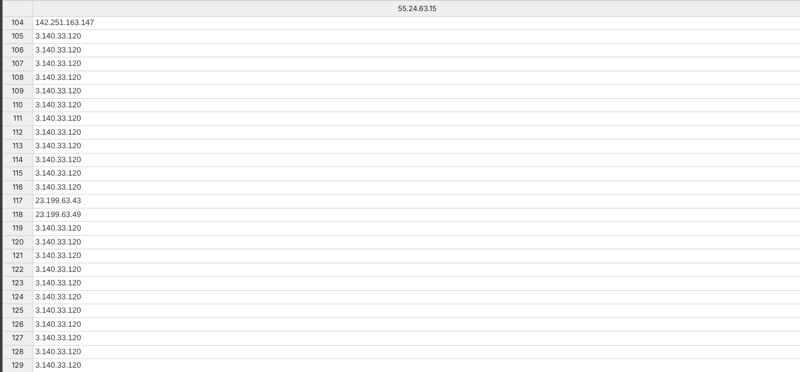

**Pivoting on the known attacker IP:**
```bash
grep -e "3.140.33.120" raw_strings.txt -B 5 -A 2 | less
```
`-B 5 -A 2` shows 5 lines of context before and 2 after each match. This recovered structured, Sysmon-style log fragments still resident in memory:

```
SourceIp: 192.168.0.104        SourceHostname: Client2.BCS.local
SourcePort: 52445 / 53027 / 53028
DestinationIp: 3.140.33.120
DestinationHostname: ec2-3-140-33-120.us-east-2.compute.amazonaws.com
DestinationPort: 9001 (repeated) / 9003 (one instance)

GET /admin/get.php HTTP/1.1
Cookie: session=UN1tOKjEVtUnlFSMboaHfZ2Lc4w=
User-Agent: Mozilla/5.0 (Windows NT 6.1; WOW64; Trident/7.0; rv:11.0) like Gecko
Host: 3.140.33.120:9001
```

The HTTP request confirms a C2 beacon (`GET /admin/get.php`) with a session cookie and a **spoofed User-Agent** impersonating IE11 on Windows 7 - despite the real host running Server 2019.

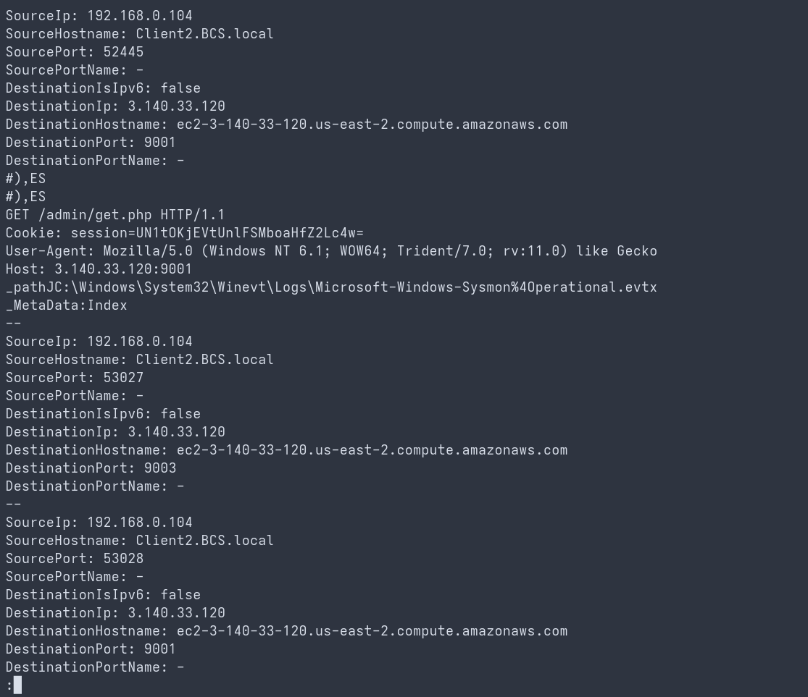
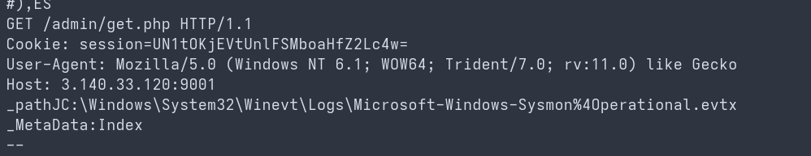

## 6. Bulk_extractor sweep

As a complementary, file-system-agnostic pass, [bulk_extractor](https://github.com/simsong/bulk_extractor) - a carving tool that splits input into 16 MiB pages and scans them in parallel for structured patterns (IPs, URLs, emails, JPEGs, etc.) without needing to parse the file system at all:

```bash
bulk_extractor -o bulk-memory memdump.mem
```

Reference used for command syntax and output interpretation: [Beginner's Guide to bulk_extractor](https://hackercoolmagazine.com/beginners-guide-to-bulk-extractor-tool/) (sections 4–5).

Took a few minutes and pegged the VM's CPU at 100%. Output: ~40 categorized feature files (`ip.txt`, `url.txt`, `email.txt`, NTFS MFT/USN/LogFile/INDX carvings, prefetch, LNK files, SQLite fragments, a reconstructed `packets.pcap`, etc.) carved straight from the raw binary.

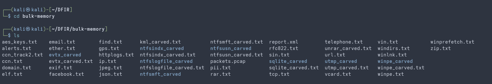

Mostly noise, as expected for an unstructured carve, but it confirms the image holds recoverable artifacts beyond what the targeted Volatility plugins surfaced. This was the point where the course material itself stopped, so a full triage of every feature file was left out of scope here.

## Automation

Running each Volatility plugin by hand against the same image gets repetitive, so `analyze.py` wraps the standard sweep:

- Runs `strings` on the memory file first (required before `windows.strings` can work), saving to `raw_strings.txt`.
- Runs a fixed list of plugins (`pslist`, `pstree`, `cmdline`, `filescan`, `netscan`, `timeliner.Timeliner`) with `-r csv` output, one CSV per plugin.
- Runs `windows.strings` last, pointed at the `raw_strings.txt` generated in the first step.
- Fails loudly (missing `vol` binary, missing `volatility3` package, plugin error) instead of silently producing partial output.

```bash
python3 analyze.py
```

CSV outputs were opened with an online CSV viewer/editor rather than Excel/LibreOffice, since some files were too large to load smoothly.

## Key Indicators of Compromise (IOCs)

| Type | Value | Notes |
|---|---|---|
| Victim host | `Client2.BCS.local` / `192.168.0.104` | |
| C2 IP | `3.140.33.120` (`ec2-3-140-33-120.us-east-2.compute.amazonaws.com`) | AWS EC2-hosted |
| C2 ports | `9001` (primary HTTP beacon), `9003` (secondary listener, referenced in registry) | |
| C2 URI | `GET /admin/get.php HTTP/1.1` | |
| Spoofed User-Agent | `Mozilla/5.0 (Windows NT 6.1; WOW64; Trident/7.0; rv:11.0) like Gecko` | IE11/Win7 masquerade on a Server 2019 host |
| Persistence (Run key) | `HKCU\Software\Microsoft\Windows\CurrentVersion\Run\Updater` | Re-launches encoded PowerShell on logon |
| Payload storage | `HKCU\Software\Microsoft\Windows\CurrentVersion\Debug` / `...\Windows Update` | Fileless payload staged in registry values |
| Masquerade | `splunk-powershell.exe` | Legitimate Splunk forwarder name used as cover |

## Attack Chain

1. Encoded, hidden-window PowerShell resident in memory (`-enc`, `-w Hidden`).
2. Registry `Run` key `Updater` created for persistence, re-invoking PowerShell on logon.
3. Payload staged fileless inside registry values (`Debug`, `Windows Update`) rather than dropped to disk.
4. HTTP beaconing to `3.140.33.120:9001` (`GET /admin/get.php`) with a spoofed browser User-Agent.
5. `cleanmgr.exe /autoclean` invoked after execution - anti-forensic cleanup.

## MITRE ATT&CK Mapping

| Technique | ID | Evidence |
|---|---|---|
| PowerShell | T1059.001 | Encoded, hidden-window PowerShell command lines |
| Registry Run Keys / Startup | T1547.001 | `Updater` value under `CurrentVersion\Run` |
| Fileless Storage: Registry | T1027.009 / T1112 | Payload staged in `Debug` / `Windows Update` registry values |
| Masquerading | T1036.005 | `splunk-powershell.exe` naming, spoofed browser User-Agent |
| Application Layer Protocol: Web | T1071.001 | HTTP `GET /admin/get.php` beacon over ports 9001/9003 |
| Indicator Removal | T1070 | `cleanmgr.exe /autoclean` post-execution |

## Detection & Mitigation

- **Registry value monitoring**: Sysmon Event ID 13 (registry value set) on `CurrentVersion\Run` and `CurrentVersion\Debug`/`Windows Update` should alert - legitimate software rarely stores executable payloads in those keys.
- **Process/service masquerading**: alert on binaries named like a known agent (`splunk-*.exe`) running from a path that doesn't match the vendor's actual install directory.
- **User-Agent anomalies**: an IE11/Windows 7 User-Agent originating from a Windows Server 2019 host is itself a detectable mismatch, cheap to rule on.
- **Memory acquisition as standard IR practice**: command lines and registry state recovered here would be largely unrecoverable from disk alone after a reboot - this is the case for capturing RAM early.
- **Don't rely on a single netscan snapshot**: the C2 connection wasn't present in this particular capture, which argues for correlating memory against PCAP/SIEM logs rather than trusting one source.

## Files in this folder

- `analyze.py` - automation script wrapping the Volatility plugin sweep and raw string extraction
- `evidences/` - screenshots and raw outputs referenced above
- `evidences/raw_strings.txt`, `strings_powershell.txt` - filtered string extraction outputs
- `evidences/windows.pstree.csv`, `windows.cmdline.csv`, `windows.netscan.csv` - targeted Volatility 3 plugin outputs

## Limitations & Notes

- The IP-extraction regex matches IP-shaped strings only; it does not validate octet ranges, so `strings_IP.csv` contains false positives that were filtered manually rather than silently dropped.
- `bulk_extractor` output was reviewed at a high level only, matching where the course material itself stopped.
- Hands-on analysis time here significantly exceeded the associated course video runtime.

## Key Takeaway

By 2008, the field had already moved past "pull the plug" as an acceptable first response - SANS' own Forensic Summit that year settled on the opposite: capture memory before anything else touches the system, because that volatile state is often the only place a fileless technique like the one in this lab (payload staged in a registry value, never written to disk) leaves a trace at all. (SANS: Memory Forensic Acquisition and Analysis 101; SANS Memory Forensics Cheat Sheet available here https://sansorg.egnyte.com/dl/wbwfDm3cdVF8 but I downloaded it ).

## Next Step → `lab-disk-analysis` (disk image forensics) 
