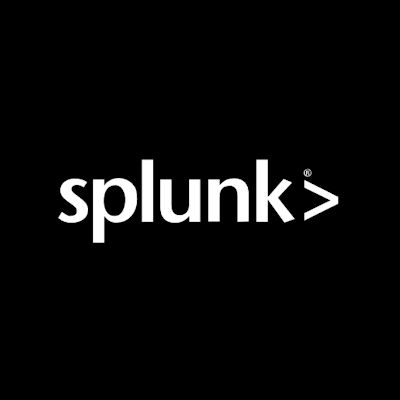

## Blue Cape Security

  <h3>Used tools</h3>
  <table>
    <tr>
      <td align="center" width="100">
         
        Splunk
      </td>
    </tr>
  </table>

 

This folder documents my hands-on pratice using the free DFIR Fooundations course by Blue Cape security . All analysis was performed on self-hosted virtual machines for educational purposes
