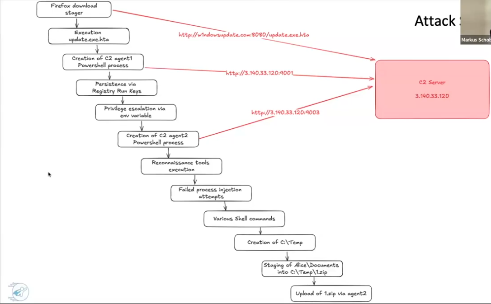

# Scenario Reveal

## What this scenario is about

This is one of the most classic shapes an attack involving C2 (command and control) takes: a user-initiated download leads to script execution, which establishes a foothold, escalates privileges, and finishes with a small, targeted exfiltration. Below is the full chain as it was pieced together across this project's labs, in the order it actually happened on the victim host (`Client2.BCS.local`, user Alice).

## The chain

1. **Firefox download stager.** The payload was downloaded via Firefox from `http://w1ndowsupdate.com:8080/update.exe.hta` — a typosquatted domain (`w1ndowsupdate`, with a digit `1` standing in for the letter `l`) designed to look like a legitimate Windows Update source.

2. **Execution of `update.exe.hta`.** Running the HTA file led directly to the creation of the first C2 agent.

3. **Creation of C2 agent 1 (PowerShell).** A PowerShell process spawned by `update.exe.hta`, communicating with the C2 server at `3.140.33.120` on port 9001.

4. **Persistence via registry Run keys.** A Run key was set to maintain contact with the C2 server across logons/reboots.

5. **Privilege escalation via environment variable.** An `Invoke-*` script (name not fully recovered) was used to obtain an elevated session, which in turn led to a second C2 agent.

6. **Creation of C2 agent 2 (PowerShell, elevated).** A second PowerShell process, this one running with admin rights, communicating with the same C2 server on port 9003.

7. **Reconnaissance.** Standard discovery commands were executed, such as `whoami`.

8. **Failed process injection attempts.** Attempts were made to inject into other processes via the registry; these did not succeed.

9. **Various shell activity.** Filesystem navigation and discovery, DNS queries, further PowerShell usage, and staging preparation in a temp location.

10. **Creation of `C:\Temp`.** This directory did not exist beforehand — it was created by the PowerShell execution as a staging area.

11. **Staging of `Alice\Documents` into `C:\Temp\1.zip`.** The target data was compressed into a single archive in preparation for exfiltration.

12. **Upload of `1.zip` via C2 agent 2.** The archive was uploaded through the second (elevated) C2 agent, then deleted locally to remove the staged copy.

All of the above was primarily visible through Wireshark (PCAP) and Splunk (SIEM/Sysmon logs); persistence and the second listener were additionally confirmed directly in memory.

## Scale and significance

The actual data exfiltrated was small — around 4 MB. But the chain covers the three things that matter most in a real incident: **initial system compromise, persistence, and exfiltration.** It's a compact, low-noise demonstration of what an attacker can do once inside — enough to walk away with something valuable, without needing a large or noisy operation to do it.

## Cross-referenced across this project

| Stage | Confirmed in |
|---|---|
| Delivery, initial PowerShell payload, C2 agent 1 | [PCAP analysis](Part-2-Elevate/01-security-operations/lab-pcap-analysis/README.md), [Splunk SIEM](Part-2-Elevate/02-incident-response-data-collection/lab-splunk_SIEM-analysis/README.md) |
| Registry persistence, C2 agent 2 / port 9003 listener | [Memory analysis](Part-2-Elevate/03-applied-forensic-analysis/lab-memory-analysis/README.md) |
| Host identity, disabled Defender protections | [Disk analysis](Part-2-Elevate/03-applied-forensic-analysis/lab-disk-analysis/README.md) |
