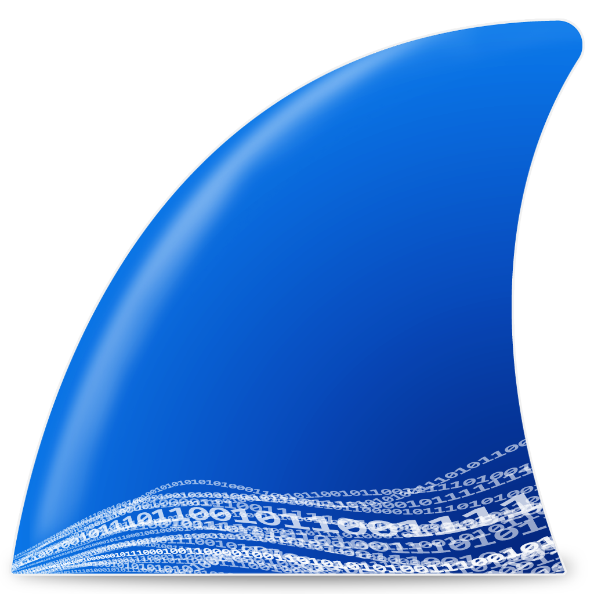
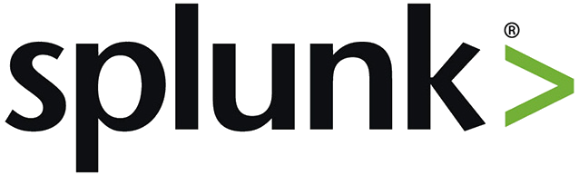
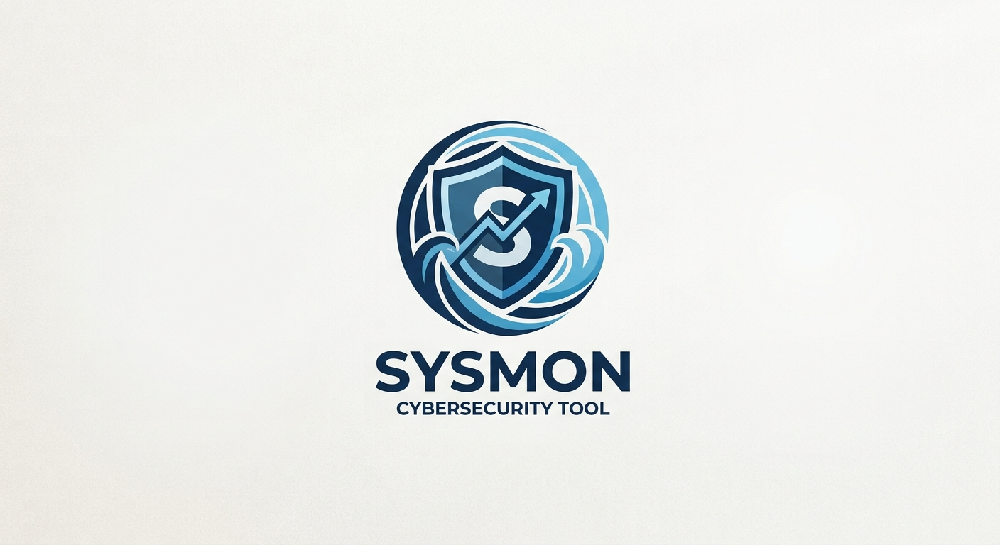
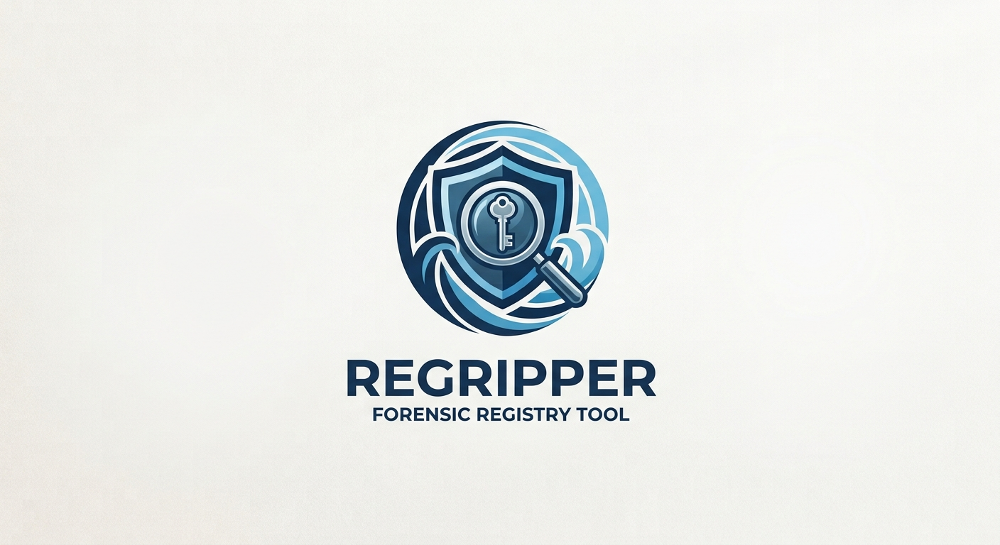
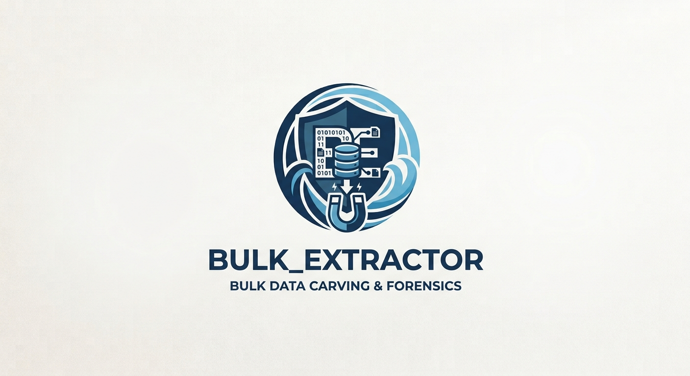
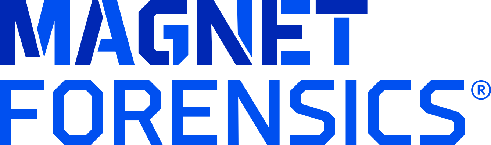
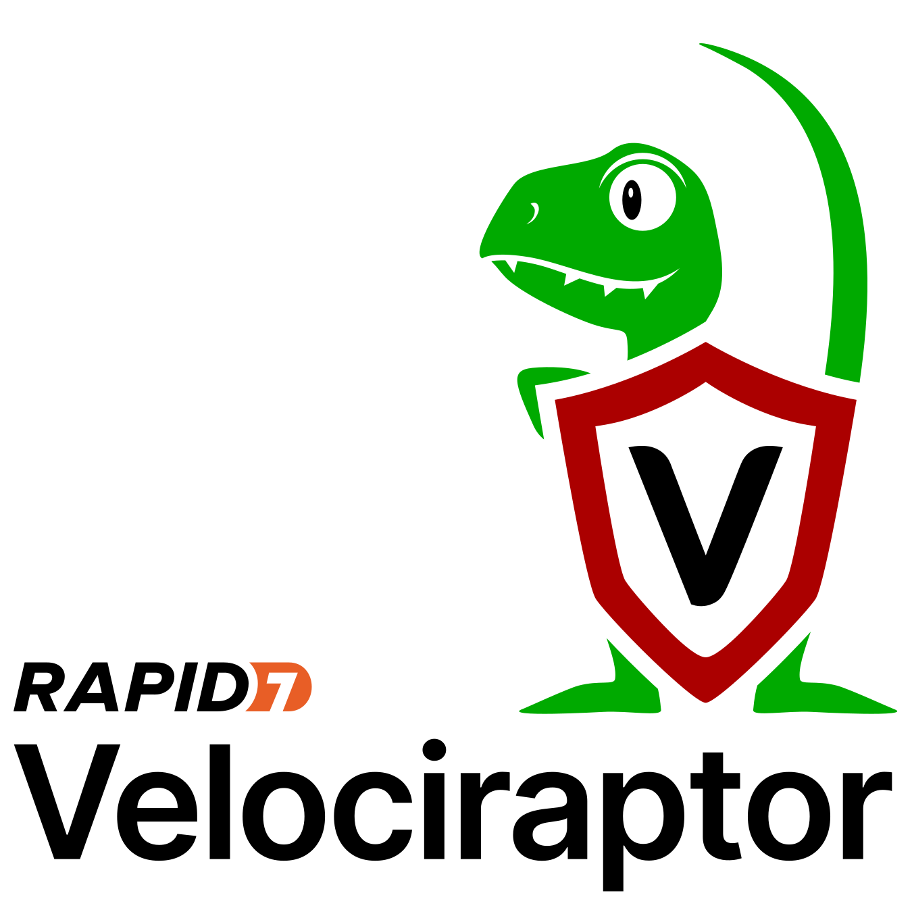
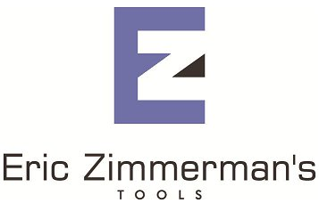

# Online-Labs

  <h3>Platforms I Train On, Tools used here</h3>
  <table>
    <tr>
      <td align="center" width="100">
         
        TryHackMe
      </td>
      <td align="center" width="100">
         
        HackTheBox
      </td>
      <td align="center" width="100">
        <!-- Replace with your local BTLO logo path -->
         
        BTLO
      </td>
      <td align="center" width="100">
         
        LetsDefend
      </td>
      <td align="center" width="100">
         
        Kali Linux
      </td>
      <td align="center" width="100">
         
        Python
      </td>
    </tr>
  </table>

   

  
  <table>
    <tr>
      <td align="center" width="100">
         
        Wireshark
      </td>
      <td align="center" width="100">
         
        Splunk
      </td>
      <td align="center" width="100">
         
        Sysmon
      </td>
      <td align="center" width="100">
         
        Volatility 3
      </td>
      <td align="center" width="100">
         
        RegRipper
      </td>
    </tr>
    <tr>
      <td align="center" width="100">
         
        bulk_extractor
      </td>
      <td align="center" width="100">
         
        FTK Imager
      </td>
      <td align="center" width="100">
         
        Velociraptor
      </td>
      <td align="center" width="100">
         
        Timesketch
      </td>
      <td align="center" width="100">
         
        EZ Tools
      </td>
    </tr>
  </table>

# 🛡️ My Cybersecurity online labs, CTF Writeups & Certifications

Hands-on documentation of my security training: **DFIR/SOC labs**, **CTF writeups**, and **certification coursework**. Everything here is practice-work — rebuildable, reviewed, and written from a blue-team perspective (each investigation ends with detection & mitigation takeaways).

## ⭐ Spotlight — Blue-Cape-DFIR

The main project: a complete, hands-on **DFIR investigation** through Blue Cape Security's *DFIR Foundations and Techniques* course — the compromise of a single workstation (`Client2.BCS.local`, "Alice") followed end-to-end across network, SIEM/EDR, memory, disk, and timeline evidence.

- Every lab is self-contained ([`README.md`](Blue-Cape-DFIR/README.md)) — commands explained at the flag level, evidence embedded inline.
- Full attack-chain reconstruction: [`Scenario-Reveal.md`](Blue-Cape-DFIR/Scenario-Reveal.md).
- **Certificate:** [`DFIR-Certificate.pdf`](Blue-Cape-DFIR/DFIR-Certificate.pdf) — 94.37% (67/71), 8 CEUs.

## 📚 Training platforms, CTFs & coursework

| Folder | Content | Status |
|---|---|---|
| [`Blue-Cape-DFIR/`](Blue-Cape-DFIR/) | Full DFIR investigation course (see Spotlight) | ✅ Documented |
| [`TryHackMe/`](TryHackMe/) | Labs: *Hacker Holidays*, *Investigate-Windows* | ✅ Documented |
| [`HackTheBox/`](HackTheBox/) | Sherlocks: *Brutus*, *PhantomRing*, *Unit42* + web cheat sheet | ✅ Documented |
| [`SANS-ctf/`](SANS-ctf/) | AWS Skills to Jobs CTF 2026 — 6 writeups + timing attack | ✅ Documented |
| [`CyberDefenders/`](CyberDefenders/) | *FakeGPT-Lab* walkthrough | ✅ Documented |
| [`Google-Cybersecurity/`](Google-Cybersecurity/) | Google Cybersecurity Certificate — courses 1–9 notes | 🚧 In progress (course notes) |
| [`LetsDefend/`](LetsDefend/) | Malware Analysis & Cybersecurity Fundamentals | 🚧 Starter only |
| [`TheForage/`](TheForage/) | TATA Cybersecurity Analyst job simulation | 🚧 Starter only |
| [`BTLO/`](BTLO/) | Blue Team Labs Online | ⏳ To come |
| [`BOTS/`](BOTS/) | BOTS (SOC simulation) | ⏳ To come |

## 🗺️ Roadmap

- **Done** — Blue-Cape-DFIR full investigation, SANS CTF writeups, 3 HackTheBox Sherlocks, TryHackMe labs, FakeGPT-Lab.
- **In progress** — Google Cybersecurity Certificate notes, LetsDefend fundamentals, TheForage simulation.
- **To come** — BTLO and BOTS SOC-style labs.

---

Prefer starting from the inside: each subfolder has its own self-contained `README.md` covering the how and why behind every finding. 

