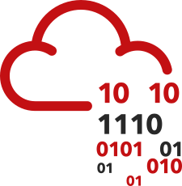

# Online-Labs

  <h3>Platforms I Train On, Tools used here</h3>
  <table>
    <tr>
      <td align="center" width="100">
         
        TryHackMe
      </td>
      <td align="center" width="100">
         
        HackTheBox
      </td>
      <td align="center" width="100">
        <!-- Replace with your local BTLO logo path -->
         
        BTLO
      </td>
      <td align="center" width="100">
         
        LetsDefend
      </td>
      <td align="center" width="100">
         
        Kali Linux
      </td>
      <td align="center" width="100">
         
        Python
      </td>
    </tr>
  </table>

   

  

# 🛡️ My Cybersecurity online labs , CTF Writeups & Certifications

Welcome to my central documentation for **TryHackMe**, **HackTheBox**, **BTLO**, **LetsDefend**, and various **CTFs**.  

## Certifications
