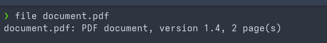
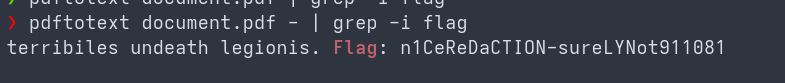

# fe02 — PDF Plaintext Flag

> **Category:** Forensics
> **Tooling used:** `file`, `pdftotext`, `strings`
> **Files:** `document.pdf`
> **Flag:** `n1CeReDaCTION-sureLYNot911081`

## Scenario

We receive a PDF document (`document.pdf`, 2 pages). The flag is hidden somewhere inside it - no password protection, no encryption, just content inspection required.

## Investigation

### 1. Confirm the file type

```bash
$ file fe02/document.pdf
```


### 2. Extract the text layer

PDFs store text both as a visible text layer and (sometimes) as embedded streams. `pdftotext` extracts the readable text:

```bash
$ pdftotext document.pdf - | grep -i flag

```


The flag is sitting in plain text in the document body (lorem-ipsum-style filler text).

**Flag:** `n1CeReDaCTION-sureLYNot911081`

## Vulnerability / Blue-team perspective

### What was actually exploitable

Secrets stored in **plain text** inside files. No encryption, no obfuscation — the flag is simply part of the document's text content. In the real world this pattern appears as hardcoded credentials, internal URLs, API keys, or personal data left in cleartext inside documents, spreadsheets, config files, and PDFs that are shared or exfiltrated.

### How a SOC / blue team would view this

Plaintext secrets in documents are a common finding in:

- **Data exfiltration cases**: the documents being stolen literally contain the sensitive data in readable form — no decryption needed by the attacker.
- **Insider threats / accidental exposure**: files shared to the wrong audience or uploaded to public repositories.

### Detection & mitigation

- **Data classification + DLP**: identify and flag files containing secrets/PII; DLP can block outbound transfers of files matching secret patterns (API keys, credit cards, SSNs).
- **Secret management**: never store credentials in documents — use a vault (e.g. HashiCorp Vault, cloud secret managers) and environment variables.
- **During IR**: `strings` and `pdftotext`/document parsing are mandatory first steps on any document artifact — cleartext data is the easiest win in an investigation, as shown here.
- **Encryption at rest / in transit** for the document store limits the impact if a file is leaked.
