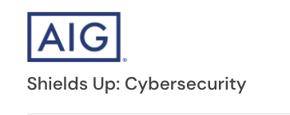
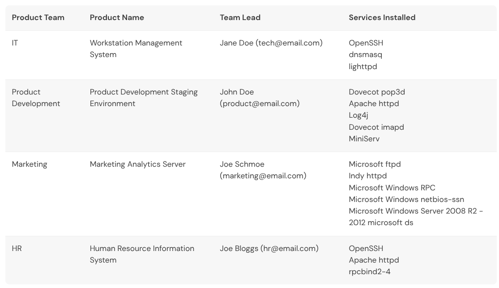
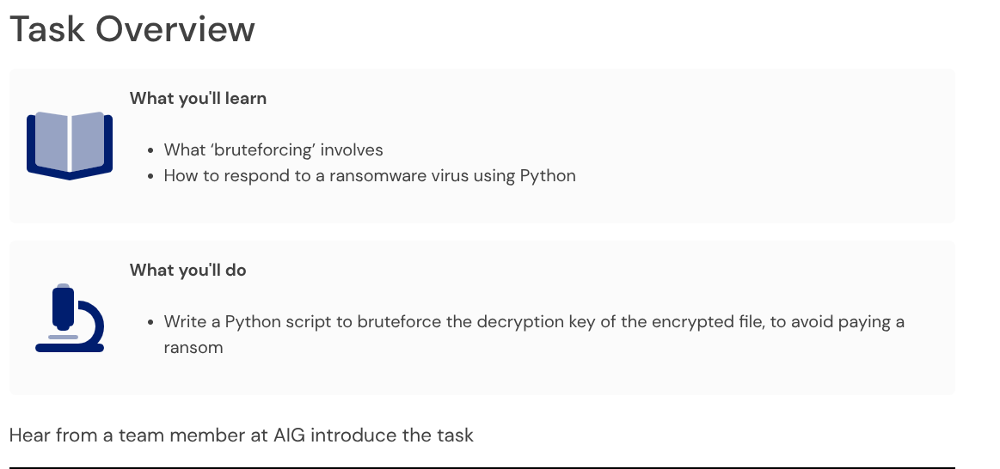

# AIG - Shields Up: Cybersecurity (Forage)



Forage virtual job simulation for AIG's Cyber & Information Security Team. Two tasks: responding to a zero-day advisory as an Information Security Analyst, then bruteforcing the decryption key of a ransomware-encrypted file after an exploitation attempt.

**Certificate / proof of completion:** simulation completed [insert completion date]; LinkedIn share posted.

---

## Task 1 - Responding to a zero-day vulnerability


### Scenario

CISA published two advisories: one on the Apache Log4j vulnerability, one on ransomware trends and professionalization. As an Information Security Analyst on AIG's Cyber & Information Security Team, the job was to research the Log4j vulnerability, cross-reference it against AIG's infrastructure, and draft an advisory to the affected team before an attacker could exploit it.

### Vulnerability research

- **Log4j2 remote code execution** (CVE-2021-44228, "Log4Shell") - an unauthenticated attacker can trigger remote code execution on any system logging attacker-controlled input through a vulnerable Log4j2 version (2.0-beta9 through 2.15.0), via JNDI lookups in log messages.
- A related follow-up (CVE-2021-45046) affected the initial 2.15.0 fix in certain non-default configurations.
- Fixed versions: **2.16.0** (Java 8) and **2.12.2** (Java 7).
- Severity: Critical - no authentication required, and exploitation only requires getting a malicious string into a log line (e.g. via a request header or username field).

### Infrastructure review

Cross-referencing the vulnerability against AIG's asset inventory to find which product/team was exposed:



| Product Team | Product Name | Services Installed | Exposed? |
|---|---|---|---|
| IT | Workstation Management System | OpenSSH, dnsmasq, lighttpd | No |
| **Product Development** | **Product Development Staging Environment** | Dovecot pop3d, Apache httpd, **Log4j**, Dovecot imapd, MiniServ | **Yes** |
| Marketing | Marketing Analytics Server | Microsoft ftpd, Indy httpd, Microsoft Windows RPC/netbios-ssn, Windows Server 2008 R2-2012 | No |
| HR | Human Resource Information System | OpenSSH, Apache httpd, rpcbind2-4 | No |

Only the **Product Development Staging Environment** runs Log4j, so it's the only asset in scope for this advisory. Owner: Product Development team (John Doe).

### Advisory email

Following AIG's advisory template (risk/impact, remediation, and a call to confirm remediation), addressed to the infrastructure owner identified above:

> **From:** AIG Cyber & Information Security Team
> **To:** Product Development Team (product@email.com)
> **Subject:** Security Advisory concerning Product Development Staging Environment | Log4j
>
> Hello John Doe,
>
> AIG Cyber & Information Security Team would like to inform you that a recent Log4j vulnerability has been discovered in the security community that may affect the Product Development Staging Environment infrastructure.
>
> **Vulnerability Overview**
> Log4j is a common open-source tool used for application logging and monitoring across the web. A vulnerability in versions Log4j2 2.0-beta9 through 2.15.0 allows an unauthenticated attacker to perform remote code execution on affected infrastructure - CVE-2021-44228 and CVE-2021-45046.
>
> **Affected products:** Log4j2 2.0-beta9 through 2.15.0
>
> **Risk & Impact:** Critical - remote code execution (RCE). An attacker could remotely access the Product Development Staging Environment to exfiltrate data or execute malicious actions.
>
> **Remediation**
> - Identify any assets or infrastructure running the affected Log4j version
> - Update to Log4j 2.16.0 (Java 8) or 2.12.2 (Java 7)
> - Watch for signs of exploitation
>
> If you identify signs of exploitation, reach out immediately. Please confirm remediation with the security team by replying to this email.
>
> Kind regards,
> AIG Cyber & Information Security Team

**Takeaway:** the advisory workflow is research → cross-reference asset inventory to find real exposure → notify only the owner of the affected system, with risk, impact, and a concrete remediation path, not a blanket warning.

---

## Task 2 - Bypassing ransomware



### Scenario

The Log4j vulnerability above was exploited on the Product Development Staging Environment before the advisory could be actioned. The Incident Detection & Response team stopped the ransomware mid-install, but it had already encrypted one zip file (`enc.zip`). AIG's CISO chose not to pay the ransom - no guarantee of a working decryption key, and no guarantee the attacker doesn't strike again - and asked for the password to be recovered by bruteforce instead, on the assumption the attacker used a common, copy-pasted payload rather than a custom key.

### Approach

A [Python bruteforce script](./bruteforce.py) that iterates through a wordlist (a subset of `rockyou.txt`) and attempts to extract `enc.zip` with each candidate password:

```python
def attempt_extract(zf, password):
    try:
        zf.extractall(pwd=password)
        return True
    except RuntimeError:
        zf.close()
        return False
```

- `password` is read from `rockyou.txt` in binary mode (`'rb'`), so it's already `bytes` - the type `zf.extractall(pwd=...)` expects; no manual encoding needed.
- A wrong password on a ZipCrypto-encrypted archive raises `RuntimeError` ("Bad password") as soon as the per-file password check fails, which is what triggered on every incorrect guess here. `attempt_extract()` returns `False` on that and closes the (now unusable) handle.
- Because a failed attempt leaves the `ZipFile` object closed, the main loop reopens it before the next try:

```python
with ZipFile('enc.zip') as zf:
    with open('rockyou.txt', 'rb') as f:
        for line in f:
            password = line.strip()
            if attempt_extract(zf, password):
                print(f"[+] Extraction successful - password: {password}")
                break
            else:
                print(f"[-] Extraction failed - password: {password}")
                zf = ZipFile('enc.zip', 'r')
```

### Result

```
$ python3 bruteforce.py
[+] Beginning bruteforce
Extraction failed for the password b'123456'
...
Extraction failed for the password b'gabriela'
Extraction successful for the password b'SPONGEBOB'
```

The password was recovered in 82 attempts - `SPONGEBOB`, an all-caps dictionary word straight out of the wordlist. It confirms the brief's assumption: a rushed, copy-pasted ransomware deployment with no custom key generation.

### Detection & Mitigation

This task is offense-flavored (cracking a password), so from a blue-team lens:

- **Detection:** repeated failed decryption/extraction attempts against an archive, or repeated failed-password events, are a bruteforce signature - worth alerting on if this pattern shows up against production systems rather than a recovery workstation.
- **Root cause, not just recovery:** the fact this password was crackable in under 100 guesses is a symptom of the Log4j RCE going unpatched, not a security control on its own - recovering the file doesn't close the exploitation path that got the attacker in.
- **Mitigation:** the real fix is upstream - patch Log4j per the Task 1 advisory, monitor for the initial exploitation attempt (e.g. JNDI lookup strings in logs), and maintain offline/immutable backups so recovery never depends on cracking the attacker's key in the first place.

---

## What I learned

- Prioritizing an advisory by cross-referencing a vulnerability against an actual asset inventory, instead of broadcasting a generic alert.
- Writing a concise, actionable security advisory: risk/impact, affected scope, remediation, and a confirmation loop.
- Bruteforcing a ZIP password in Python with `zipfile`, including the handle-reuse gotcha after a failed `extractall()` attempt.
- Reframing an offensive recovery technique (bruteforcing) in terms of what it reveals about the upstream failure (unpatched RCE) and what actually prevents a repeat.