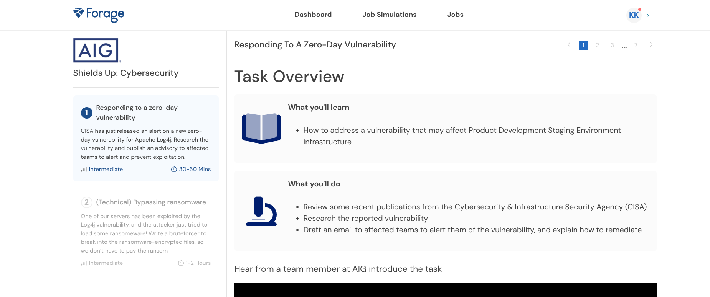
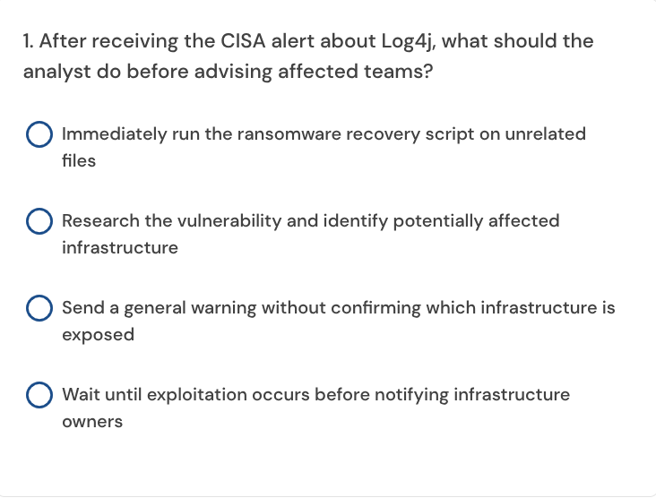

## Task 1 Responding to a zero-day vulnerability

Here are the instructions for your task
The CISA has recently published the following two advisories:
https://www.cisa.gov/news-events/cybersecurity-advisories/aa21-356a
https://www.cisa.gov/news-events/news/cisa-fbi-nsa-and-international-partners-issue-advisory-ransomware-trends-2021
The first advisory (Log4j), outlines a serious vulnerability in one of the world’s most popular logging software.
The second advisory explores how ransomware has been increasing and is becoming professionalized - a concern for a large company like AIG.
Your task is to respond to the Apache Log4j zero-day vulnerability that was released to the public by advising affected teams of the vulnerability. 

First, conduct your research on the vulnerability using the “CISA Advisory" resources provided above as a starting point.

Next, analyze the “Infrastructure List” below to find out which infrastructure may be affected by the vulnerability, and which team has ownership.


Draft your advisory email below
To finish this task, draft an advisory email to alert the infrastructure owner of the seriousness of this vulnerability. 

For inspiration, you can use the email template provided below from our last cyber threat advisory.

```text
From: AIG Cyber & Information Security Team
To: <affected team>
Subject: Security Advisory concerning <affected product> <affected software>
—
Body: 
Hello <affected team owner>,

AIG Cyber & Information Security Team would like to inform you that a recent <affected software> vulnerability has been discovered in the security community that may affect <affected product>.

<vulnerability description>

<vulnerability risk/impact>

<vulnerability remediation>

<any assurances to ensure advisory was actioned>

For any questions or issues, don’t hesitate to reach out to us.

Kind regards,
AIG Cyber & Information Security Team
```


Example advisory email
Great work!

There are many ways you could have attempted this task, as advisory emails come in all shapes and sizes. Below you'll find one example of an advisory email alerting the infrastructure owner of the seriousness of this vulnerability.

From: AIG Cyber & Information Security Team
To: Product Development Team (product@email.com)
Subject: Security Advisory concerning Product Development Staging Environment | Log4j
—
Body:
Hello John Doe,

AIG Cyber & Information Security Team would like to inform you that a recent Log4j vulnerability has been discovered in the security community that may affect the Product Development Staging Environment infrastructure.

Vulnerability Overview
Log4j is a common open-source tool used for application logging and monitoring across the web. Recently, a vulnerability has been identified in versions Log4j2 2.0-beta9 through 2.15.0 that would allow an unauthenticated attacker to perform remote code execution on affected infrastructure, making this a critical vulnerability. You can learn more in the NIST disclosures: NVD - CVE-2021-44228 and NVD - CVE-2021-45046.

Affected products
Log4j2 2.0-beta9 through 2.15.0

Risk & Impact
Critical - remote code execution (RCE). An attacker will be able to remotely access the Product Development Staging Environment infrastructure to exfiltrate data or execute malicious actions.

Remediation
● Identify any assets or infrastructure running the affected Log4j version
● Update to the following versions: Log4j 2.16.0 (Java 8) and 2.12.2 (Java 7)
● Be on the lookout for any signs of exploitation

If you identified any signs of exploitation, please immediately reach out. After you have remediated this vulnerability, please confirm with the security team by replying to this email.

For any questions or issues, don’t hesitate to reach out to us.

Kind regards,
AIG Cyber & Information Security Team


### Task 2 Bypassing ransomware


* Setting the scene for your next task
Your advisory email in the last task was great. It provided context to the affected teams on what the vulnerability was, and how to remediate it. 

Unfortunately, an attacker was able to exploit the vulnerability on the affected server and began installing a ransomware virus. Luckily, the Incident Detection & Response team was able to prevent the ransomware virus from completely installing, so it only managed to encrypt one zip file. 

Internally, the Chief Information Security Officer does not want to pay the ransom, because there isn’t any guarantee that the decryption key will be provided or that the attackers won’t strike again in the future. 

Instead, we would like you to bruteforce the decryption key. Based on the attacker’s sloppiness, we don’t expect this to be a complicated encryption key, because they used copy-pasted payloads and immediately tried to use ransomware instead of moving around laterally on the network.

* Here is the background information for your task
In this task, you will write a Python script to bruteforce the decryption key of the encrypted file.

Bruteforcing is the act of repeatedly trying different combinations to break the password encryption (based on either randomly generated passwords, or from a list of passwords to try). In the resource below, we've provided a small subset of passwords from Rockyou - a widely know password wordlist that contains thousands of common passwords in one wordlist.

Ransomware will often encrypt all files on a device, and sometimes give the decryption key after the ransom has been paid (but this is not always the case!). In this task, we would like you to break the encryption without paying the ransom.

A foundational Python 3+ template has also been provided for you in the resource below. One potential implementation is described in the code comments.

After, open the decrypted word doc and paste your Python code in the text field below. We'll show you an example answer on the next step, but we encourage you to give it a go first!


sample provided after 

```python
from zipfile import ZipFile

def attempt_extract(zf_handle, password):
    try:
        zf_handle.extractall(pwd=password)
        return True
    except:
        return False

def main():
    print("[+] Beginning bruteforce ")
    with ZipFile('enc.zip') as zf:
        with open('rockyou.txt', 'rb') as f:
            for p in f:
                password = p.strip()
                if attempt_extract(zf, password):
                    print("[+] Correct password: %s" % password)
                    exit(0)
                else:
                    print("[-] Incorrect password: %s" % password)

    print("[+] Password not found in list")

if __name__ == "__main__":
    main()

```

now last quizes





Uses
https://www.canva.com/design/DAFl7ChBdDM/r4eSUvu_ANmkqukuwM7_6Q/view?utm_content=DAFl7ChBdDM&utm_campaign=designshare&utm_medium=link&utm_source=viewer